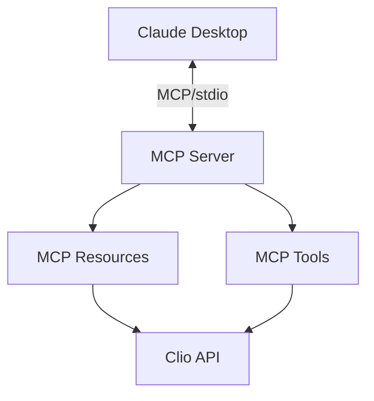

# LegalContext MCP Server

LegalContext is an open-source Model Context Protocol (MCP) server that creates a secure bridge between law firms' document management systems (specifically Clio) and AI assistants (starting with Claude Desktop). It enables AI tools to access, retrieve, and incorporate firm document context while maintaining complete security and control over sensitive information.

## Project Status

⚠️ **Development Status**: This project is in active development. Core MCP functionality is implemented, but document management integration is still in progress.
about
## Core Functionality

The current implementation includes:

- ✅ Basic MCP server with stdio transport
- ✅ Resource and tool registration
- ✅ Example resources and tools
- ✅ Configuration management
- ✅ Testing infrastructure

## Getting Started

### Prerequisites

- [Bun](https://bun.sh/) 1.0 or higher
- [Claude Desktop](https://claude.ai/desktop) (for integration testing)

### Installation

1. Clone the repository:

```bash
git clone https://github.com/protomated/legalcontext.git
cd legalcontext
```

2. Install dependencies:

```bash
bun install
```

3. Build the project:

```bash
bun run build
```

### Running the Server

Start the server with:

```bash
bun run start
```

### Testing the MCP Server

You can test the MCP server using the included test client:

```bash
bun run test:client
```

This will start the server and connect a test client that will verify the basic functionality.

## Architecture

LegalContext is built around a modular NestJS architecture:



The system is designed to keep all document processing within the firm's security perimeter, with zero sensitive data transmitted to external servers.

## Documentation

Additional documentation can be found in the `docs` directory:
- [About LegalContext](docs/about-legal-text.md) - The "why" behind LegalContext
- [MCP Server Implementation Guide](docs/mcp-server-guide.md) - Overview of the MCP implementation
- [Claude Desktop Integration](docs/mcp-client-integration.md) - Guide to integrating with Claude Desktop
- [Security Architecture](docs/security-architecture.md) - Overview of the security design
- [Development Roadmap](docs/development-roadmap.md) - Planned features and timeline

## Core Components

### McpServerService

Manages the MCP server lifecycle and connection to Claude Desktop.

### McpResourcesService

Handles registration and management of resources that provide document context.

### McpToolsService

Manages tools that enable Claude to perform actions like searching or retrieving documents.

### McpOrchestratorService

Coordinates the initialization and operation of the MCP components.

## Security

LegalContext prioritizes security at every level:

1. **Data Boundary Control**: All document processing occurs locally
2. **Secure Transport**: Uses stdio for communication with Claude Desktop
3. **Access Control**: Respects document management system permissions
4. **Zero Data Transmission**: No document content sent to external servers

See the [Security Architecture](docs/security-architecture.md) document for more details.

## Contributing

Contributions are welcome! See [CONTRIBUTING.md](CONTRIBUTING.md) for guidelines.

## License

LegalContext is licensed under the [Mozilla Public License 2.0](LICENSE).

## Support

For support, please open an issue on GitHub or contact us at ask@protomated.com.
