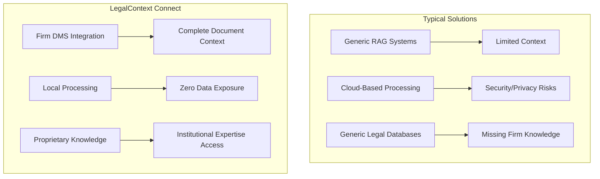
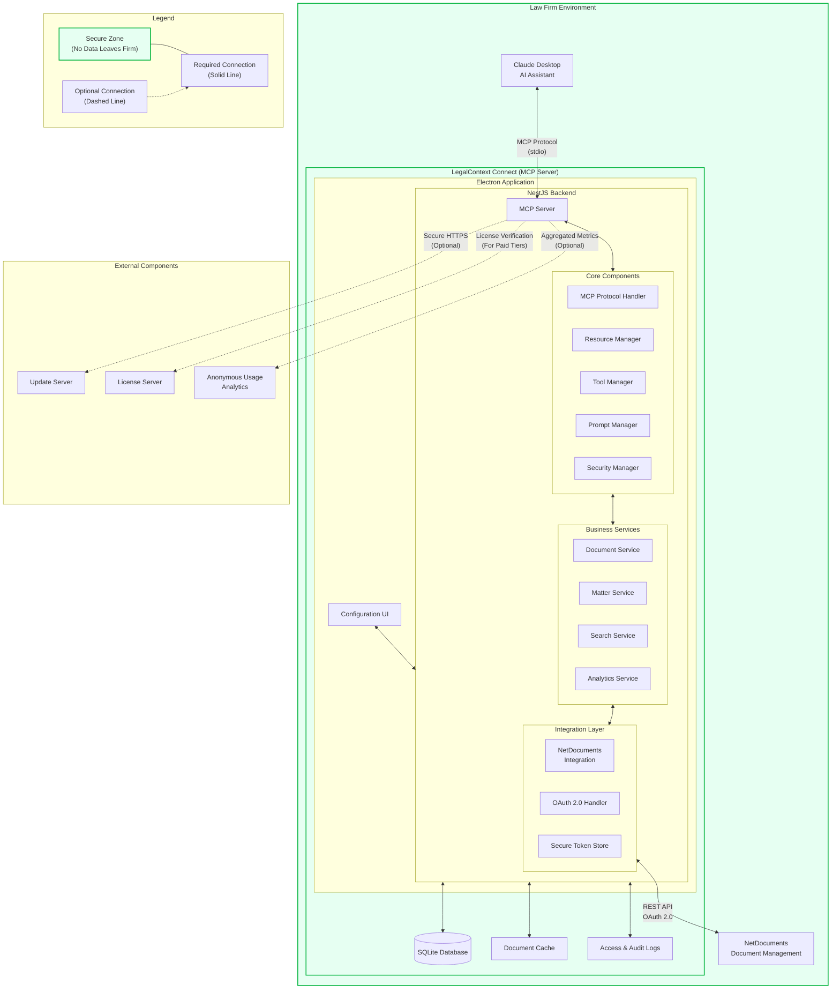
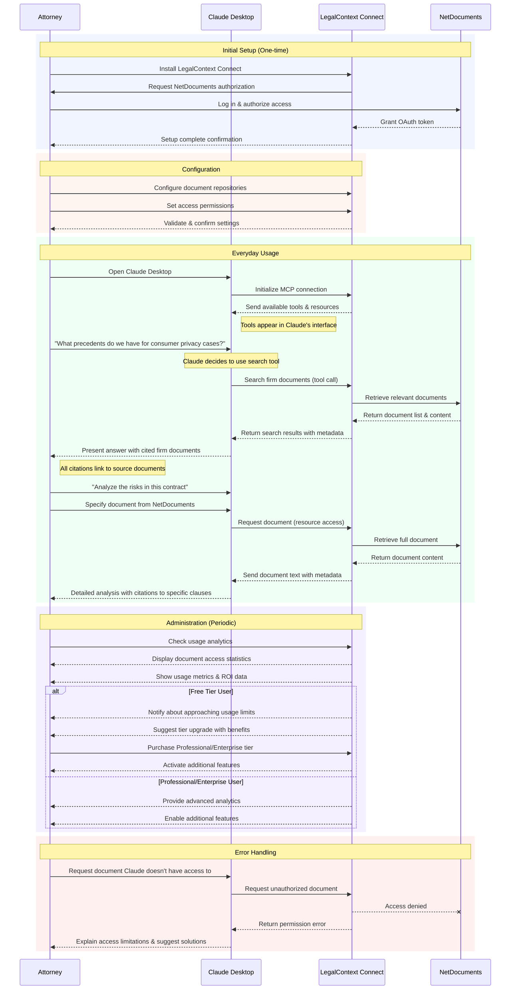

# LegalContext Connect

  
   
  <em>Secure AI document context for law firms</em>

## Overview

LegalContext Connect is an open-source Model Context Protocol (MCP) server that creates a secure, standardized bridge between law firms' document management systems (specifically NetDocuments) and AI assistants (starting with Claude Desktop). It enables AI tools to access, retrieve, and incorporate firm document context while maintaining complete security and control over sensitive information.

**Key Value Proposition**: Transform AI from a liability risk into a trusted legal assistant by ensuring all AI responses are grounded in your firm's actual documents and expertise.

**Product Website**: [https://protomated.com/legalcontext](https://protomated.com/legalcontext)

## Why LegalContext Connect?

### The Challenge: AI Hallucinations in Legal Practice

Despite advancements in AI for legal work, hallucinations remain a critical problem:

- A Stanford study found that even the latest legal AI tools hallucinate in 1 out of 6 (or more) queries, despite using Retrieval Augmented Generation (RAG)
- Courts have disciplined lawyers in at least seven cases over the last two years for submitting AI-generated fake case citations
- The now-infamous case of a New York lawyer who submitted a brief with non-existent cases cited by ChatGPT highlights the risks

### Current Solutions Fall Short

Existing approaches have significant limitations:

- **General Purpose RAG Systems**: Not specialized for legal workflows or document management
- **Public Legal Databases**: Lack access to firm-specific knowledge and precedents
- **Cloud-Based Solutions**: Send sensitive data outside firm security perimeters
- **Legal Research Add-ons**: Integrate with research tools but not document management systems

### The LegalContext Connect Difference

What makes our approach unique:

#### 1. Secure by Design
- **100% Local Processing**: All document handling happens within your firm's network
- **Zero External Data Transmission**: No document content ever leaves your security perimeter
- **Respects Existing Permissions**: Maintains NetDocuments access controls and security model

#### 2. Firm-Specific Knowledge
- **Your Documents, Your Knowledge**: Surfaces your firm's unique precedents and expertise
- **Institutional Memory**: Makes collective knowledge accessible to junior attorneys
- **Practice-Specific Context**: Draws on your specialized work product across practice areas

#### 3. Seamless Integration
- **Direct NetDocuments Connection**: Purpose-built for the leading legal DMS
- **Claude Desktop Native**: Optimized for Claude's capabilities and citation handling
- **No Workflow Changes**: Works within attorneys' existing tools and processes

## LegalContext Connect vs. Alternative Solutions

LegalContext Connect addresses the unique challenges of AI in legal practice in ways that other solutions cannot:

| Feature | LegalContext Connect | Generic RAG Systems | Legal Research AI | General Purpose AI |
|---------|---------------------|---------------------|-------------------|-------------------|
| **Knowledge Source** | 🟢 Firm-specific documents & expertise | 🟡 Generic knowledge bases | 🟡 Public legal databases | 🔴 General training data |
| **Data Processing** | 🟢 100% local processing | 🔴 Cloud processing | 🔴 Cloud processing | 🔴 Cloud processing |
| **Document Integration** | 🟢 Native NetDocuments integration | 🔴 No DMS integration | 🔴 Research tool focus | 🔴 No document integration |
| **Hallucination Prevention** | 🟢 Firm knowledge + citation tracking | 🟡 Limited context | 🟡 Generic citations | 🔴 High hallucination risk |
| **Workflow Integration** | 🟢 Seamless with Claude Desktop | 🟡 Requires workflow changes | 🔴 Standalone product | 🟡 Generic capabilities |
| **Security & Compliance** | 🟢 Zero data exposure | 🔴 External data processing | 🔴 External data processing | 🔴 External data processing |

🟢 = Excellent &nbsp;&nbsp; 🟡 = Moderate &nbsp;&nbsp; 🔴 = Poor/None

### Comparison with Standard RAG Systems

While Retrieval Augmented Generation (RAG) has become the standard approach for reducing AI hallucinations, most RAG implementations for legal work have significant limitations:

1. **Public Knowledge vs. Firm Knowledge**
   - Standard RAG: Limited to public legal databases and precedents
   - LegalContext: Accesses your firm's proprietary documents and expertise

2. **Data Security**
   - Standard RAG: Typically processes documents in the cloud
   - LegalContext: 100% local processing within your security perimeter

3. **Document Integration**
   - Standard RAG: Generic document connections requiring manual uploads
   - LegalContext: Direct NetDocuments integration with preserved permissions

4. **Workflow Optimization**
   - Standard RAG: Standalone tools requiring workflow changes
   - LegalContext: Seamless integration with existing attorney workflows

### Legal Research AI vs. LegalContext Connect

Legal research platforms with AI capabilities differ fundamentally from LegalContext Connect:

1. **Focus Area**
   - Legal Research AI: Primary legal authorities and public records
   - LegalContext: Your firm's unique knowledge and document corpus

2. **Use Case**
   - Legal Research AI: Finding relevant precedents and authorities
   - LegalContext: Leveraging institutional knowledge and work product

3. **Integration**
   - Legal Research AI: Separate tools from document workflow
   - LegalContext: Integrated into document management system

## Key Features

### 🔒 Secure Document Integration
- Creates a protected pathway for Claude to access documents stored in NetDocuments
- All document processing happens locally within your firm's network
- Zero sensitive data exposed outside your security perimeter

### 📚 Contextual Retrieval
- Intelligently surfaces relevant firm documents when attorneys ask legal questions
- Ensures AI responses are grounded in the firm's actual knowledge and precedents
- Enables access to document content across practice areas and matters

### 📝 Citation Tracking
- Automatically adds proper citations to AI outputs
- Links each statement to specific firm documents for verification
- Creates an audit trail for AI-generated content

### ❌ Hallucination Prevention
- Dramatically reduces AI "hallucinations" by grounding responses in actual firm documents
- Prevents the generation of fictional case law, precedents, or legal principles
- Increases reliability and trustworthiness of AI output

### 🧠 Knowledge Amplification
- Makes the firm's collective expertise accessible to every attorney
- Helps junior staff leverage institutional knowledge previously siloed across the organization
- Extends the impact of expert attorneys throughout the firm

### 💼 Workflow Integration
- Seamlessly integrates with existing attorney workflows
- No new interfaces to learn
- Maintains NetDocuments security model and permissions

## Technical Implementation

LegalContext Connect is built on a modern technology stack optimized for security, reliability, and ease of deployment:

### Core Technologies
- **NestJS**: Backend framework for building scalable and maintainable server applications
- **Electron**: Cross-platform desktop application framework for the configuration UI
- **SQLite**: Embedded database for storing configuration and metadata
- **TypeScript**: Type-safe programming language for robust application development
- **OAuth 2.0**: Secure authentication with NetDocuments

### MCP Implementation
- Built on Anthropic's MCP TypeScript SDK
- Implements standardized MCP resource and tool endpoints
- Provides configuration interfaces for NetDocuments connection

### NetDocuments Integration
- REST API integration with NetDocuments cloud platform
- OAuth 2.0 authentication implementation
- Document content extraction and metadata handling
- Document history and version tracking

### Security Architecture
- All document processing occurs locally within firm network
- OAuth 2.0 integration with NetDocuments credentials
- Document-level access control respecting NetDocuments permissions
- Comprehensive query and access logging
- Open-source code available for security team review

## Technical Architecture

## User Flow and Experience

## Getting Started

### Prerequisites
- Windows 10+ or macOS 12+ 
- Claude Desktop application installed
- NetDocuments account with appropriate API permissions
- Node.js 16 or higher

### Installation

1. Download the latest release from the [releases page](https://github.com/protomated/legalcontext-connect/releases)

2. Run the installer and follow the setup wizard

3. Launch LegalContext Connect and configure your NetDocuments connection:
   - Enter your NetDocuments organization ID
   - Complete the OAuth authorization flow
   - Select document repositories to make available

4. Configure Claude Desktop to use LegalContext Connect:
   - During installation, LegalContext Connect will automatically configure Claude Desktop
   - You'll be prompted to restart Claude Desktop to apply the changes
   - After restarting, LegalContext Connect will guide you through a test process to verify connectivity

5. Restart Claude Desktop and verify connection:
   - Look for the tools icon in the Claude interface
   - Try these sample prompts to test the connection:
      - *"Can you summarize the key points from our recent settlement agreement with Acme Corp?"*
      - *"What precedents do we have for consumer data privacy cases in the healthcare sector?"*
      - *"Find documents related to non-compete agreements that we've drafted in the last year."*
      - *"What are the common clauses we include in our software licensing agreements?"*
      - *"Can you analyze the risks in the Johnson contract that was uploaded to NetDocuments last week?"*
   - You should see Claude requesting permission to access documents before responding
   - Successful responses will include citations to specific documents in your NetDocuments repository

### Free Tier Limitations

The open-source version includes the following limitations:

- 100 documents maximum
- 2 Claude Desktop users maximum
- 50 queries per day
- Single NetDocuments repository
- 3 concurrent requests maximum
- Daily document indexing (not real-time)

To remove these limitations, check our [pricing page](https://protomated.com/legalcontext#pricing) for Professional and Enterprise options.

## Contributing

We welcome contributions to LegalContext Connect! Please see [CONTRIBUTING.md](CONTRIBUTING.md) for guidelines on how to contribute.

## License

LegalContext Connect is licensed under the [Mozilla Public License 2.0](LICENSE).

## Support

- **Documentation**: [https://protomated.com/legalcontext-docs](https://protomated.com/legalcontext-docs)
- **Community Forum & Issues**: [GitHub Issues](https://github.com/protomated/legalcontext-connect/issues)
- **Professional Support**: [ask@protomated.com](mailto:ask@protomated.com)

---

© 2025 Protomated, Inc.
