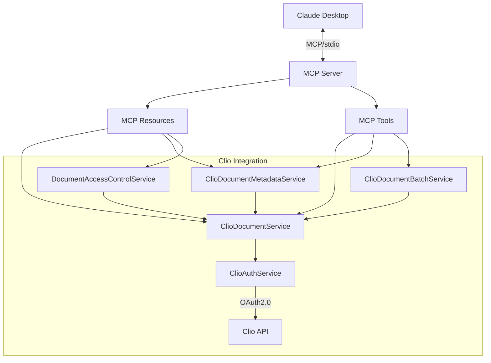

# LegalContext MCP Server

LegalContext is an open-source Model Context Protocol (MCP) server that creates a secure bridge between law firms' document management systems (specifically Clio) and AI assistants (starting with Claude Desktop). It enables AI tools to access, retrieve, and incorporate firm document context while maintaining complete security and control over sensitive information.

## Project Status

⚠️ **Development Status**: This project is in active development. Core MCP functionality and Clio API integration are implemented, with document processing and additional features in progress.

## Core Functionality

The current implementation includes:

- ✅ Basic MCP server with stdio transport
- ✅ Resource and tool registration
- ✅ Example resources and tools
- ✅ Configuration management
- ✅ Testing infrastructure
- ✅ OAuth 2.0 authentication with Clio
- ✅ Secure document API integration with Clio
- ✅ Document access control and permissions
- ✅ Document metadata extraction and normalization

## Getting Started

### Prerequisites

- [Bun](https://bun.sh/) 1.0 or higher
- [Claude Desktop](https://claude.ai/desktop) (for integration testing)
- Clio Developer Account (for API access)

### Installation

1. Clone the repository:

```bash
git clone https://github.com/protomated/legal-context.git
cd legal-context
```

2. Install dependencies:

```bash
bun install
```

3. Configure OAuth for Clio API:

   a. Create a `.env.local` file in the project root:
   ```
   # Clio OAuth Configuration
   CLIO_CLIENT_ID=your_client_id_here
   CLIO_CLIENT_SECRET=your_client_secret_here
   CLIO_REDIRECT_URI=http://127.0.0.1:3000/clio/auth/callback
   CLIO_API_URL=https://app.clio.com/api/v4
   
   # Security Configuration
   ENCRYPTION_KEY=your_random_32_character_string_here
   
   # Database Configuration
   DATABASE_HOST=localhost
   DATABASE_PORT=5432
   DATABASE_USERNAME=postgres
   DATABASE_PASSWORD=postgres
   DATABASE_NAME=legalcontext_dev
   ```

   b. Obtain Clio API credentials:
   - Log in to your Clio Developer account at https://app.clio.com/settings/developer/applications
   - Create a new application with the following settings:
     - Name: LegalContext
     - Redirect URI: http://127.0.0.1:3000/clio/auth/callback
     - Scopes: documents
   - Copy the Client ID and Client Secret to your `.env.local` file

   c. Run the OAuth setup script to authenticate with Clio:
   ```bash
   bun run start:dev
   ```

   d. In a separate terminal, run the Clio authentication setup:
   ```bash
   bun run test:clio:auth
   ```

4. Build the project:

```bash
bun run build
```

### Running the Server

Start the server with:

```bash
bun run start
```

For development with auto-reload:

```bash
bun run start:dev
```

### Testing

#### MCP Server Testing

You can test the MCP server using the included test client:

```bash
bun run test:client
```

This will start the server and connect a test client that will verify the basic functionality.

#### Clio API Integration Testing

Verify your Clio integration with the following test scripts:

```bash
# Test Clio authentication
bun run test:clio:auth

# Test document listing and retrieval
bun run test:clio:docs

# Test document access control
bun run test:clio:access

# Test MCP-Clio integration
bun run test:mcp:docs
```

These tests will verify that your Clio authentication is working, you can access documents, and that the MCP server can properly integrate with Clio documents.

### Configuring Claude Desktop

1. Install Claude Desktop from https://claude.ai/desktop
2. Create a `claude-config.json` file in your Claude Desktop configuration directory:
   - Windows: `%APPDATA%\Claude\claude-config.json`
   - macOS: `~/Library/Application Support/Claude/claude-config.json`
   - Linux: `~/.config/Claude/claude-config.json`

3. Add the following configuration (adjust the path to your LegalContext installation):
```json
{
  "mcpServers": {
    "legalcontext": {
      "command": "bunx",
      "args": [
        "run",
        "start",
        "--prefix",
        "/path/to/legal-context"
      ],
      "cwd": "/path/to/legal-context"
    }
  }
}
```

4. Restart Claude Desktop

## Architecture

LegalContext is built around a modular NestJS architecture:



The system is designed to keep all document processing within the firm's security perimeter, with zero sensitive data transmitted to external servers.

## Documentation

Additional documentation can be found in the `docs` directory:
- [About LegalContext](docs/about-legal-context.md) - The "why" behind LegalContext
- [Claude Desktop Integration](docs/mcp-client-integration.md) - Guide to integrating with Claude Desktop
- [Security Architecture](docs/security-architecture.md) - Overview of the security design
- [Development Roadmap](docs/development-roadmap.md) - Planned features and timeline

## Core Components

### MCP Components

#### McpServerService

Manages the MCP server lifecycle and connection to Claude Desktop.

#### McpResourcesService

Handles registration and management of resources that provide document context.

#### McpToolsService

Manages tools that enable Claude to perform actions like searching or retrieving documents.

#### McpOrchestratorService

Coordinates the initialization and operation of the MCP components.

### Clio Integration Components

#### ClioAuthService

Manages OAuth 2.0 authentication with Clio, including token acquisition, refresh, and storage.

#### ClioDocumentService

Handles direct API interactions with Clio's document endpoints, providing CRUD operations for documents.

#### ClioDocumentMetadataService

Provides specialized metadata extraction, normalization, and organization of document information.

#### ClioDocumentBatchService

Offers batch operations for efficient handling of multiple documents from Clio.

#### DocumentAccessControlService

Enforces access permissions to ensure documents are only accessed by authorized users.

## Security

LegalContext prioritizes security at every level:

1. **Data Boundary Control**: All document processing occurs locally within the firm's network
2. **Secure Transport**: Uses stdio for communication with Claude Desktop
3. **Access Control**: Enforces Clio's document access permissions at every level
4. **Zero Data Transmission**: No document content sent to external servers
5. **OAuth 2.0 with PKCE**: Implements secure authorization flow with Clio
6. **Secure Token Management**: Encrypted storage of access and refresh tokens
7. **Automatic Token Refresh**: Maintains authentication without user intervention
8. **Access Logging**: Comprehensive audit logging of document access

See the [Security Architecture](docs/security-architecture.md) document for more details.

## Contributing

Contributions are welcome! See [CONTRIBUTING.md](CONTRIBUTING.md) for guidelines.

## License

LegalContext is licensed under the [Mozilla Public License 2.0](LICENSE).

## Support

For support, please open an issue on GitHub or contact dele@protomated.com.
