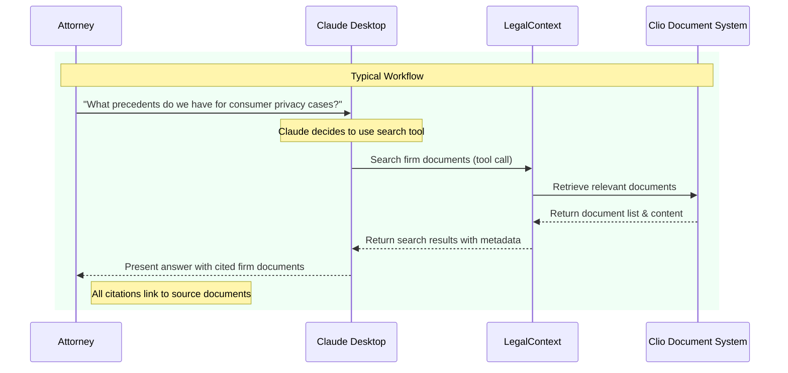

# LegalContext
## Secure AI document context for law firms

[](https://github.com/protomated/legalcontext-connect/blob/main/LICENSE)
[](https://github.com/protomated/legalcontext-connect/releases)

## Table of Contents

1. [Overview](#overview)
2. [The AI Hallucination Crisis in Legal Practice](#the-ai-hallucination-crisis-in-legal-practice)
3. [How LegalContext Solves This Problem](#how-legalcontext-connect-solves-this-problem)
4. [User Flow Diagram](#user-flow-diagram)
5. [LegalContext vs. Alternative Solutions](#legalcontext-connect-vs-alternative-solutions)
6. [Key Features](#key-features)
7. [Technical Architecture](#technical-architecture)
8. [Frequently Asked Questions](#frequently-asked-questions)
9. [Getting Started](#getting-started)
   - [Prerequisites](#prerequisites)
   - [Installation](#installation)
   - [Free Tier Limitations](#free-tier-limitations)
10. [Licensing Tiers and Pricing](#licensing-tiers-and-pricing)
    - [Free Open Source](#free-open-source)
    - [Professional](#professional)
    - [Enterprise](#enterprise)
    - [Additional Services](#additional-services)
11. [For Collaborators](#for-collaborators)
    - [Development Setup](#development-setup)
    - [Project Structure](#project-structure)
    - [Testing](#testing)
    - [Deployment](#deployment)
12. [Contributing](#contributing)
13. [License](#license)
14. [Support](#support)

## Overview

LegalContext is an open-source Model Context Protocol (MCP) server that creates a secure, standardized bridge between law firms' document management systems (specifically Clio) and AI assistants (starting with Claude Desktop). It enables AI tools to access, retrieve, and incorporate firm document context while maintaining complete security and control over sensitive information.

**Key Value Proposition**: Transform AI from a liability risk into a trusted legal assistant by ensuring all AI responses are grounded in your firm's actual documents and expertise.

## The AI Hallucination Crisis in Legal Practice

AI hallucinations pose a critical risk in legal settings, as evidenced by several high-profile cases:

- A recent Stanford study found that even the latest legal AI tools hallucinate in 1 out of 6 (or more) queries, despite using Retrieval Augmented Generation (RAG). While some legal tech companies claim their tools are "hallucination-free," Stanford researchers found that LexisNexis and Thomson Reuters AI tools each hallucinate between 17% and 33% of the time. [Source: [Stanford HAI](https://hai.stanford.edu/news/ai-trial-legal-models-hallucinate-1-out-6-or-more-benchmarking-queries), [Stanford Law School](https://law.stanford.edu/publications/hallucination-free-assessing-the-reliability-of-leading-ai-legal-research-tools/)]

- Federal judges have imposed serious sanctions on attorneys for relying on AI hallucinations. In one Manhattan case, two New York lawyers were fined $5,000 for submitting fictional cases generated by ChatGPT. A Texas lawyer was ordered to pay a $2,000 penalty and attend AI education courses after citing nonexistent cases and fabricated quotations. [Source: [Reuters](https://www.reuters.com/technology/artificial-intelligence/ai-hallucinations-court-papers-spell-trouble-lawyers-2025-02-18/), [Bloomberg Law](https://news.bloomberglaw.com/litigation/lawyer-sanctioned-over-ai-hallucinated-case-cites-quotations)]

- Lawyers at Morgan & Morgan, one of the nation's largest personal injury firms, faced sanctions when their internal AI platform "hallucinated" fake cases. The judge fined the primary attorney $3,000 and revoked his temporary admission to practice. [Source: [ABA Journal](https://www.abajournal.com/news/article/no-42-law-firm-by-headcount-could-face-sanctions-over-fake-case-citations-generated-by-chatgpt), [Clio Blog](https://www.clio.com/blog/ai-hallucination-case/)]

- These incidents led Morgan & Morgan to send an urgent email to its more than 1,000 lawyers warning that "Artificial intelligence can invent fake case law, and using made-up information in a court filing could get you fired." [Source: [Reuters](https://www.reuters.com/technology/artificial-intelligence/ai-hallucinations-court-papers-spell-trouble-lawyers-2025-02-18/)]

- As Judge Marcia Crone noted, "The duties imposed by Rule 11 require that attorneys read, and thereby confirm the existence and validity of, the legal authorities on which they rely." Multiple courts have emphasized that AI use does not excuse attorneys from their professional responsibility to verify sources. [Source: [Baker Botts](https://www.bakerbotts.com/thought-leadership/publications/2024/december/trust-but-verify-avoiding-the-perils-of-ai-hallucinations-in-court)]

## How LegalContext Solves This Problem

LegalContext addresses the hallucination crisis through a fundamentally different approach to AI document integration:

### 1. Firm-Specific Document Grounding

Unlike generic RAG systems or public legal databases, LegalContext:
- Connects directly to your firm's Clio document management system
- Makes your firm's proprietary knowledge and precedents available to Claude
- Ensures AI responses are based on your actual documents, not imagined cases
- Creates an institutional memory accessible to all your attorneys

### 2. Secure Local Processing

All document processing occurs completely within your firm's security perimeter:
- Zero document content transmitted to external servers
- No sensitive data exposed to third parties
- Complies with client confidentiality requirements
- Maintains Clio's existing security model and permissions

### 3. Citation Tracking & Verification

Every statement generated by the AI is transparently linked to its source:
- Automatic citation of specific firm documents
- Clear attribution to enable verification
- Prevention of unsourced claims
- Audit trail for AI-generated content

## User Flow Diagram



## LegalContext vs. Alternative Solutions

| Feature | LegalContext                           | Generic RAG Systems | Legal Research AI | General Purpose AI |
|---------|----------------------------------------|---------------------|-------------------|-------------------|
| **Knowledge Source** | 🟢 Firm-specific documents & expertise | 🟡 Generic knowledge bases | 🟡 Public legal databases | 🔴 General training data |
| **Data Processing** | 🟢 100% local processing               | 🔴 Cloud processing | 🔴 Cloud processing | 🔴 Cloud processing |
| **Document Integration** | 🟢 Native Clio integration             | 🔴 No DMS integration | 🔴 Research tool focus | 🔴 No document integration |
| **Hallucination Prevention** | 🟢 Firm knowledge + citation tracking  | 🟡 Limited context | 🟡 Generic citations | 🔴 High hallucination risk |
| **Workflow Integration** | 🟢 Seamless with Claude Desktop        | 🟡 Requires workflow changes | 🔴 Standalone product | 🟡 Generic capabilities |
| **Security & Compliance** | 🟢 Zero data exposure                  | 🔴 External data processing | 🔴 External data processing | 🔴 External data processing |

🟢 = Excellent &nbsp;&nbsp; 🟡 = Moderate &nbsp;&nbsp; 🔴 = Poor/None

### Why LegalContext Is Different

While many solutions claim to solve the AI hallucination problem, they fall short in key ways:

1. **Superior to Existing RAG Systems**
   - A June 2024 Stanford study found that even leading RAG-based legal AI tools from LexisNexis and Thomson Reuters hallucinate 17-33% of the time
   - Generic RAG systems rely on text similarity rather than legal relevance
   - LegalContext grounds AI responses in your firm's actual knowledge, not public databases

2. **Better Than Clio Duo**
   - Complements rather than competes with Clio's native AI
   - Provides integration with Claude's advanced capabilities
   - Allows flexibility in AI assistant choice
   - Works with your existing document management system

3. **More Secure Than Cloud Solutions**
   - No sensitive data transmitted outside your firm
   - Complete control over document access
   - Maintains existing security permissions
   - Protects client confidentiality

## Key Features

### 🔒 Secure Document Integration
- Creates a protected pathway for Claude to access documents stored in Clio
- All document processing happens locally within your firm's network
- Zero sensitive data exposed outside your security perimeter

### 📚 Contextual Retrieval
- Intelligently surfaces relevant firm documents when attorneys ask legal questions
- Ensures AI responses are grounded in the firm's actual knowledge and precedents
- Enables access to document content across practice areas and matters

### 📝 Citation Tracking
- Automatically adds proper citations to AI outputs
- Links each statement to specific firm documents for verification
- Creates an audit trail for AI-generated content

### ❌ Hallucination Prevention
- Dramatically reduces AI "hallucinations" by grounding responses in actual firm documents
- Prevents the generation of fictional case law, precedents, or legal principles
- Increases reliability and trustworthiness of AI output

### 🧠 Knowledge Amplification
- Makes the firm's collective expertise accessible to every attorney
- Helps junior staff leverage institutional knowledge previously siloed across the organization
- Extends the impact of expert attorneys throughout the firm

### 💼 Workflow Integration
- Seamlessly integrates with existing attorney workflows
- No new interfaces to learn
- Maintains Clio security model and permissions

## Technical Architecture

```mermaid
graph TB
    %% Define styles
    classDef secureZone fill:#e6fff2,stroke:#00b33c,stroke-width:2px
    
    subgraph LawFirm["Law Firm Environment"]
        %% Claude Desktop
        Claude[Claude Desktop<br>AI Assistant]
        
        %% MCP Section
        subgraph MCP["LegalContext (MCP Server)"]
            subgraph NestJS["NestJS Backend"]
                Server["MCP Server"]
                
                subgraph Core["Core Components"]
                    McpHandler["MCP Protocol Handler"]
                    ResourceMgr["Resource Manager"]
                    ToolMgr["Tool Manager"]
                    PromptMgr["Prompt Manager"]
                    SecurityMgr["Security Manager"]
                end
                
                subgraph Services["Business Services"]
                    DocService["Document Service"]
                    MatterService["Matter Service"]
                    SearchService["Search Service"]
                    AnalyticsService["Analytics Service"]
                end
                
                subgraph Integration["Integration Layer"]
                    ClioIntegration["Clio Integration"]
                    OAuthHandler["OAuth 2.0 Handler"]
                    TokenStore["Secure Token Store"]
                end
            end
            
            DB[(SQLite Database)]
            Cache["Document Cache"]
            Logs["Access & Audit Logs"]
        end
        
        %% Clio Section
        Clio["Clio<br>Document Management"]
        
        %% Flow between components
        Claude <--> |"MCP Protocol<br>(stdio)"| Server
        Server <--> Core
        Core <--> Services
        Services <--> Integration
        Integration <--> |"REST API<br>OAuth 2.0"| Clio
        
        NestJS <--> DB
        NestJS <--> Cache
        NestJS <--> Logs
    end
    
    %% Apply styles to elements
    class LawFirm secureZone
    class MCP secureZone
```



## Frequently Asked Questions

### Privacy & Security

#### Does LegalContext send my documents to external services?
No. All document processing happens 100% locally within your firm's network. LegalContext creates a secure bridge between Clio and Claude Desktop that keeps your documents within your security perimeter at all times. Your document content never leaves your firm's environment or gets transmitted to external servers. [Source: [TechTarget](https://www.techtarget.com/searchenterpriseai/news/366616516/Anthropics-new-standard-raises-AI-privacy-other-concerns)]

#### Does Claude use my document data for training?
No. Anthropic (Claude's creator) has a clear policy stating: "We will not use your Inputs or Outputs to train our models" by default. The only exceptions are if: (1) your conversations are flagged for Trust & Safety review, or (2) you explicitly opt-in by submitting feedback. [Source: [Anthropic Privacy Center](https://privacy.anthropic.com/en/articles/10023555-how-do-you-use-personal-data-in-model-training)]

#### Who can view my conversations with Claude?
By default, Anthropic employees cannot access your conversations. Limited access is provided only when: (1) you explicitly consent to share data through feedback, or (2) review is needed to enforce their Usage Policy. Even then, only designated Trust & Safety team members may access this data on a need-to-know basis. [Source: [Anthropic Help Center](https://support.anthropic.com/en/articles/8325621-i-would-like-to-input-sensitive-data-into-free-claude-ai-or-claude-pro-who-can-view-my-conversations)]

#### How is my data protected?
Anthropic implements multiple security measures: (1) Data is encrypted both in transit and at rest, (2) Access controls limit who can view your data, (3) Regular security monitoring and vulnerability checks are performed, and (4) Employee access follows the principle of least privilege. [Source: [Anthropic Privacy Center](https://privacy.anthropic.com/en/articles/10458704-how-does-anthropic-protect-the-personal-data-of-claude-ai-users)]

#### How long is my data retained?
For LegalContext, which implements the Model Context Protocol (MCP), your data is handled according to your firm's policies. For all Anthropic products, they automatically delete inputs and outputs on the backend within 30 days of receipt or generation, unless otherwise agreed. [Source: [Anthropic Privacy Center](https://privacy.anthropic.com/en/articles/10023548-how-long-do-you-store-personal-data)]

### Technical Questions

#### How does LegalContext work with MCP?
LegalContext is built on Anthropic's Model Context Protocol (MCP), an open standard that enables secure two-way connections between data sources and AI tools. MCP handles both local resources (your Clio documents) and ensures Claude can access them through a standardized interface. [Source: [VentureBeat](https://venturebeat.com/data-infrastructure/anthropic-releases-model-context-protocol-to-standardize-ai-data-integration/)]

#### Can I control which documents Claude can access?
Yes. LegalContext respects Clio's existing security model and permissions. You can specify which document repositories Claude can access during setup, and the system maintains all access controls defined in Clio. You'll also be prompted for approval before Claude accesses any documents.

#### Do I need to install additional software?
You'll need to install Claude Desktop and LegalContext. During installation, LegalContext will automatically configure Claude Desktop to use it. No additional software is required beyond the prerequisites listed in the installation section.

#### Can I use LegalContext with other document management systems?
The current version supports Clio. We're working on integrations with additional document management systems for future releases. If you're interested in a specific integration, please contact us at ask@protomated.com.

#### Is LegalContext compatible with my operating system?
LegalContext is compatible with Windows 10 or later and macOS 12 or later. It requires Claude Desktop, which is available for the same operating systems.

### Troubleshooting

#### What should I do if Claude can't access my documents?
1. Verify that LegalContext is properly configured and running
2. Check that your Clio account has the necessary API permissions
3. Confirm that you've completed the OAuth authorization flow
4. Ensure the document repositories are properly selected
5. Restart Claude Desktop if necessary

#### How do I update LegalContext?
LegalContext includes an auto-update feature that checks for new versions. You can also manually check for updates through the application menu. Updates are downloaded and installed automatically.

#### Who do I contact for support?
For technical support, please visit our documentation at https://help.protomated.com/legalcontext or submit an issue on our GitHub repository. For professional support, contact us at ask@protomated.com.

## Getting Started

### Prerequisites
- Windows 10+ or macOS 12+ 
- Claude Desktop application installed
- Clio account with appropriate API permissions
- Node.js 16 or higher

### Installation

1. Download the latest release from the [releases page](https://github.com/protomated/legalcontext-connect/releases)

2. Run the installer and follow the setup wizard

3. Launch LegalContext and configure your Clio connection:
   - Enter your Clio organization ID
   - Complete the OAuth authorization flow
   - Select document repositories to make available

4. Configure Claude Desktop to use LegalContext:
   - During installation, LegalContext will automatically configure Claude Desktop
   - You'll be prompted to restart Claude Desktop to apply the changes
   - After restarting, LegalContext will guide you through a test process to verify connectivity

5. Restart Claude Desktop and verify connection:
   - Look for the tools icon in the Claude interface
   - Try these sample prompts to test the connection:
      - *"Can you summarize the key points from our recent settlement agreement with Acme Corp?"*
      - *"What precedents do we have for consumer data privacy cases in the healthcare sector?"*
      - *"Find documents related to non-compete agreements that we've drafted in the last year."*
      - *"What are the common clauses we include in our software licensing agreements?"*
      - *"Can you analyze the risks in the Johnson contract that was uploaded to Clio last week?"*
   - You should see Claude requesting permission to access documents before responding
   - Successful responses will include citations to specific documents in your Clio repository

### Free Tier Limitations

The open-source version includes the following limitations:

- 100 documents maximum
- 2 Claude Desktop users maximum
- 50 queries per day
- Single Clio repository
- 3 concurrent requests maximum
- Daily document indexing (not real-time)

To remove these limitations, check our [pricing page](https://protomated.com/legalcontext#pricing) for Professional and Enterprise options.

## Licensing Tiers and Pricing

LegalContext is available in three licensing tiers to accommodate firms of all sizes and requirements.

### Free Open Source

Our community edition is ideal for small firms and solo practitioners:

- **Price**: Free
- **Features**:
  - Full document search and retrieval
  - Secure local processing
  - Citation tracking
  - Basic document indexing
- **Limitations**:
  - 100 documents maximum
  - 2 Claude Desktop users maximum
  - 50 queries per day
  - Single Clio repository
  - 3 concurrent requests maximum
  - Daily document indexing (not real-time)
- **Support**: Community forum and GitHub issues

### Professional

For small to medium law firms requiring additional capacity and features:

- **Price**: $99/month per user
- **Features**:
  - All Free tier features
  - Unlimited documents
  - Real-time document indexing
  - Advanced security controls
  - Enhanced document processing
  - Multi-repository support
  - Usage analytics and reporting
- **Support**: 
  - Email support with 48-hour response time
  - Knowledge base access
  - Quarterly security updates

### Enterprise

Designed for medium to large firms with complex security and compliance needs:

- **Price**: $199/month per user (volume discounts available)
- **Features**:
  - All Professional features
  - Unlimited concurrent requests
  - Advanced document analytics
  - Custom integration capabilities
  - On-premises deployment option
  - High availability configuration
  - Custom security policies
  - Document utilization insights
  - Priority feature development
  - Custom branding
- **Support**:
  - Dedicated account manager
  - Priority support with 4-hour response time
  - Quarterly business reviews
  - Custom training sessions
  - 24/7 critical issue response

### Additional Services

Protomated offers complementary services to enhance your LegalContext deployment:

#### Implementation Services

- **Setup & Configuration**: $1,500 one-time fee
  - Full environment setup
  - Clio integration configuration
  - Document repository optimization
  - User training sessions (2 hours)
  - Go-live support

- **Custom Integration Development**: Starting at $5,000
  - Integration with additional document management systems
  - Custom workflow automation
  - Data migration services
  - Security assessment and hardening

#### Ongoing Support Options

- **Standard Support Plan**: Included with Professional tier
  - Email support during business hours
  - 48-hour response time
  - Access to knowledge base

- **Premium Support Plan**: $500/month
  - Phone and email support
  - 8-hour response time
  - Monthly health checks
  - Dedicated support contact

- **Enterprise Support Plan**: Included with Enterprise tier
  - 24/7 critical issue support
  - 4-hour response time
  - Quarterly system reviews
  - Dedicated account manager

#### Training and Documentation

- **User Training**: $750 per session (up to 10 users)
  - 2-hour live training
  - Custom training materials
  - Hands-on exercises
  - Q&A session

- **Admin Training**: $1,200 per session
  - 4-hour technical training
  - Advanced configuration
  - Troubleshooting techniques
  - Performance optimization

For custom pricing or to discuss specific requirements, please contact our sales team at sales@protomated.com.

## For Collaborators

This section provides detailed information for developers and contributors who want to work on LegalContext.

### Development Setup

#### Prerequisites
- Bun 1.0 or higher
- PostgreSQL 15 with pgvector extension
- Clio Developer account with API access
- Claude Desktop for testing

#### Local Development Environment

1. **Clone the repository**

```bash
git clone https://github.com/protomated/legalcontext-connect.git
cd legalcontext-connect
```

2. **Install dependencies**

```bash
bun install
```

3. **Set up environment variables**

Create a `.env.local` file based on the `.env.example` template:

```bash
cp .env.example .env.local
```

Edit the `.env.local` file and fill in your Clio API credentials and other configuration values.

4. **Set up the development database**

```bash
# If using Docker
docker-compose up -d postgres-dev

# Or manually create PostgreSQL database with pgvector
# See docker/postgres/init-vector.sql for required schema setup
```

5. **Run the OAuth setup**

```bash
bun run setup
```

This will walk you through the Clio OAuth authorization flow to get valid access tokens.

6. **Start the development server**

```bash
bun run start:dev
```

The server will be available at http://localhost:3000.

7. **Configure Claude Desktop**

Edit your Claude Desktop configuration to use the local MCP server:

```json
{
  "mcpServers": {
    "legalcontext": {
      "command": "bun",
      "args": ["run", "start:dev"],
      "cwd": "/path/to/legalcontext-connect"
    }
  }
}
```

### Project Structure

The project follows a modular NestJS architecture:

```
legalcontext-connect/
├── src/
│   ├── main.ts                  # Application entry point
│   ├── app.module.ts            # Root module
│   ├── config/                  # Configuration handling
│   ├── mcp/                     # MCP Server module
│   │   ├── mcp.module.ts        
│   │   ├── mcp-server.service.ts
│   │   ├── resources/           # MCP resources implementation
│   │   └── tools/               # MCP tools implementation
│   ├── clio/                    # Clio Integration module
│   │   ├── clio.module.ts       
│   │   ├── auth/                # OAuth authentication
│   │   ├── api/                 # Clio API client
│   │   └── dto/                 # Data transfer objects
│   ├── document-processing/     # Document Processing module
│   │   ├── extractors/          # Text extraction services
│   │   ├── chunking/            # Document chunking service
│   │   ├── embedding/           # Vector embedding service
│   │   └── indexing/            # Search and indexing services
│   └── database/                # Database module
│       └── entities/            # Database entities
├── test/                        # Test directory
│   ├── e2e/                     # End-to-end tests
│   └── unit/                    # Unit tests
├── docker/                      # Docker configuration
└── scripts/                     # Utility scripts
```

### Testing

The project includes several types of tests to ensure quality and reliability:

#### Unit Tests

Run unit tests to verify individual components:

```bash
# Run all unit tests
bun run test

# Run tests with coverage report
bun run test:cov

# Run tests in watch mode during development
bun run test:watch
```

#### Integration Tests

Test interaction between components:

```bash
# Run integration tests
bun run test:integration
```

#### End-to-End Tests

Test complete flows from Claude Desktop to Clio and back:

```bash
# Run e2e tests
bun run test:e2e
```

#### Mock Clio API

For development and testing, you can use the mock Clio API server:

```bash
# Start mock Clio API server
bun run start:mock-clio
```

This provides a simulated Clio API environment with test documents and OAuth endpoints.

### Deployment

LegalContext supports multiple deployment options:

#### Docker Deployment

The simplest way to deploy is using Docker Compose:

```bash
# Build and start production containers
docker-compose up -d legalcontext-prod
```

This will set up PostgreSQL with pgvector and the MCP server in production mode.

#### Manual Deployment

For on-premises deployment:

1. **Build the production version**

```bash
bun run build
```

2. **Configure environment**

Ensure all environment variables are set correctly for production.

3. **Set up PostgreSQL**

Install PostgreSQL with pgvector extension and run the initialization scripts.

4. **Start the server**

```bash
NODE_ENV=production bun run start:prod
```

#### Scaling Considerations

- For increased document capacity, consider upgrading to PostgreSQL with more CPU and RAM
- For multiple users, ensure the server has sufficient concurrent connection capacity
- Consider using a load balancer for high-availability deployments
- Implement proper backup strategies for the PostgreSQL database

#### Monitoring and Maintenance

- Set up health checks to monitor the MCP server
- Schedule regular backups of the PostgreSQL database
- Implement log rotation for audit logs
- Create an update strategy for security patches

## Contributing

We welcome contributions to LegalContext! Please see [CONTRIBUTING.md](CONTRIBUTING.md) for guidelines on how to contribute.

## License

LegalContext is licensed under the [Mozilla Public License 2.0](LICENSE).

## Support

- **Documentation**: [https://help.protomated.com/legalcontext](https://help.protomated.com/legalcontext)
- **Community Forum & Issues**: [GitHub Issues](https://github.com/protomated/legalcontext-connect/issues)
- **Professional Support**: [ask@protomated.com](mailto:ask@protomated.com)

---

© 2025 Protomated
