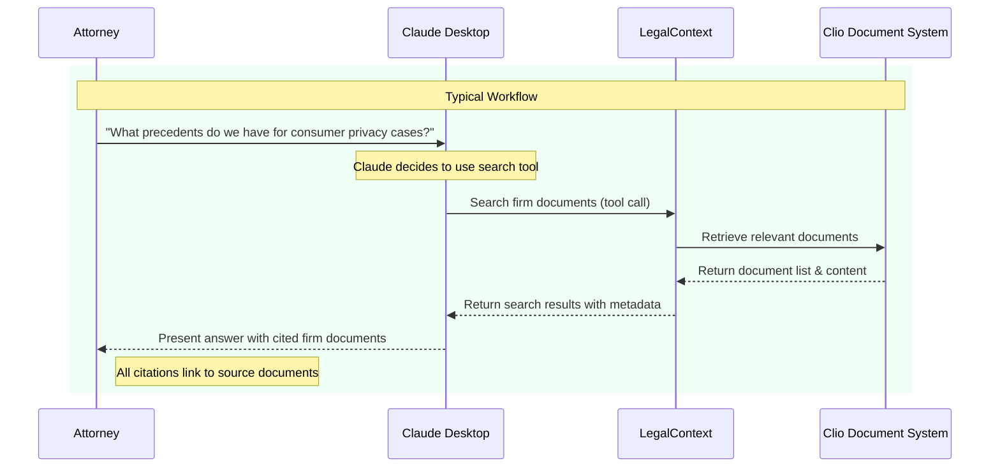
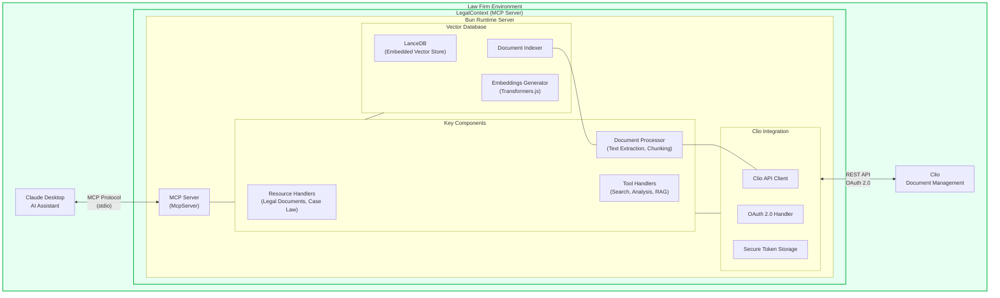

# LegalContext: Secure Semantic Search for Legal Document Management

## Executive Summary

The practice of law faces a critical inflection point at the intersection of artificial intelligence and legal work. While AI promises unprecedented efficiency gains, lawyers are rightfully skeptical about adopting tools that could compromise client confidentiality, generate hallucinations, or otherwise undermine their ethical obligations. These concerns are magnified when dealing with sensitive legal documents stored within practice management systems like Clio.

LegalContext offers a revolutionary solution to these challenges by providing a secure, local-first bridge between your document management system and AI assistants like Claude. By creating a protected pathway for semantic search through your legal documents without exposing confidential information to third-party servers, LegalContext helps you:

1. **Find critical information faster** - Semantic search goes beyond keyword matching to understand concepts and meaning, dramatically reducing time spent searching for specific clauses, precedents, or facts
2. **Maintain complete data privacy** - All document indexing and processing happens locally within your firm's security perimeter; no document content is transmitted to external AI servers
3. **Prevent AI hallucinations** - Responses are grounded in your firm's actual documents, eliminating fictitious case law or invented facts
4. **Establish clear citation trails** - Every AI response includes citations to specific documents, ensuring verifiable, traceable information

In an environment where judges are increasingly imposing sanctions for AI hallucinations and where protecting client confidentiality is paramount, LegalContext provides a path to leverage AI's power while maintaining full adherence to legal ethics and professional responsibility.

## The Crisis of Information Retrieval in Legal Practice

### The High Cost of Finding Information

Law firms face a persistent and costly challenge: the sheer amount of time wasted searching for information. Studies indicate lawyers can spend up to 2.5 hours daily just searching for information, with approximately 4.3 hours per week lost specifically to unsuccessful searches or recreating documents they couldn't find. This inefficiency directly impacts profitability, potentially costing firms between $66,000 to $97,500 per lawyer annually in lost billable hours.

The problem is particularly acute within document management systems like Clio, where users report significant frustrations with search functionality:

- Search matching works strictly from left-to-right, causing failures when searching for partial terms
- Arbitrary limits on search results (e.g., caps of 200 documents) that can hide relevant files
- Inability to see folder structures or paths for documents in search results
- Cumbersome workflows requiring manual filtering after initial search

These limitations create a perfect storm where lawyers waste billable hours navigating an inefficient system, leading to increased frustration, delayed case preparation, and a higher risk of missing critical information.

### The Limitations of Traditional Search

Traditional keyword-based search suffers from fundamental limitations when applied to legal document repositories:

1. **Synonym blindness** - Different documents may use varied terminology to discuss the same concept (e.g., "compensation" vs. "remuneration")
2. **Context insensitivity** - Keyword search cannot understand the meaning or importance of terms in different contexts
3. **Conceptual gaps** - Legal arguments often involve abstract concepts not captured by literal terms
4. **Information overload** - Too many results requiring manual review and filtering

These limitations force lawyers to spend hours manually reviewing documents that may or may not contain the information they need—hours that could otherwise be spent on high-value legal work.

### The Document Review Bottleneck

Document review represents one of the most significant bottlenecks in legal workflows. The sheer volume of data, particularly Electronically Stored Information (ESI), has grown exponentially, overwhelming traditional review methods. Document review often accounts for 70-80% of total litigation costs, consuming vast amounts of attorney time while still being susceptible to human error, fatigue, and reviewer bias.

The consequences of ineffective document review can be severe: court sanctions, adverse rulings, or the inability to build a strong case due to missed information. As the volume and complexity of legal documentation continue to grow, this bottleneck threatens to become even more constricting.

## The AI Revolution: Promise and Peril

Artificial Intelligence, particularly large language models (LLMs) like Claude, offers tremendous potential to transform legal work. However, skepticism among legal professionals is well-founded and centers around several key concerns:

### 1. AI Hallucinations: A Documented Liability

AI "hallucinations"—the generation of fabricated information—pose a serious professional risk. Recent cases highlight the danger:

- In 2023, a federal judge in Manhattan fined two New York lawyers $5,000 for citing cases that were invented by AI in a personal injury case
- A Texas lawyer was ordered to pay a $2,000 penalty and attend AI education courses after citing nonexistent cases
- Morgan & Morgan, one of the nation's largest personal injury firms, issued an urgent email to over 1,000 lawyers warning that using AI-generated fake case law could result in termination

A Stanford study found that even leading AI tools from major legal providers hallucinate in 1 out of 6 queries, demonstrating that this is not a problem limited to general-purpose AI systems—it affects specialized legal AI as well.

### 2. Client Confidentiality and Attorney-Client Privilege Risks

Using AI tools can potentially compromise attorney-client privilege and violate ethical duties of confidentiality:

- Most public AI systems retain user inputs for model training and improvement
- Many AI providers reserve the right to share data with third-party vendors
- Information shared with public AI tools may not maintain the confidentiality required to preserve attorney-client privilege
- ABA Model Rule 1.6 requires lawyers to make "reasonable efforts to prevent inadvertent or unauthorized disclosure" of client information

The legal consequences of unauthorized disclosure can be severe, potentially waiving privilege and exposing clients to legal risks.

### 3. Data Security Concerns

Law firms manage highly sensitive client information that requires rigorous protection:

- Standard cloud-based AI solutions transmit document content to external servers
- Third-party AI providers may have access to confidential information
- Data may be stored, analyzed, or used for model training
- The exact security measures protecting this information are often opaque

When judges are now requiring lawyers to disclose AI use and certify that no confidential information has been disclosed to unauthorized parties, these security concerns become even more pressing.

## LegalContext: A Secure Bridge to AI-Enhanced Legal Work

LegalContext provides a fundamentally different approach to integrating AI with legal document management. Unlike conventional solutions that require uploading documents to cloud services, LegalContext creates a secure, local-first pipeline that maintains data privacy while unlocking powerful AI capabilities.

### Core Architecture and Security Model

LegalContext's architecture is built around a crucial distinction: **index locally, query securely**. This approach:

1. **Keeps documents within your security perimeter** - Documents never leave your network; only the text of your specific queries and the minimal context needed for responses are transmitted
2. **Processes document content locally** - Text extraction, chunking, and vector embedding generation all happen on your local machine
3. **Maintains a secure local index** - Document vectors and metadata are stored in a local LanceDB database, never transmitted to external servers
4. **Provides a controlled interface** - The Model Context Protocol (MCP) establishes a standardized, secure method for Claude to access only the specific information needed

This architecture fundamentally addresses privacy and security concerns by ensuring:

- **No bulk document upload** - Unlike other AI solutions, your entire document corpus is never transmitted
- **Minimized data exposure** - Only the specific chunks relevant to a query are used to ground Claude's responses
- **Complete local control** - You decide which documents to index, and the index remains on your machine
- **Clear data boundaries** - The system establishes explicit gates between your documents and the AI

### Key Features and Benefits

#### 1. Semantic Search Through Vector Embeddings

LegalContext goes beyond traditional keyword search by using vector embeddings to capture the meaning and context of your documents:

- Documents are split into semantically meaningful chunks
- These chunks are converted into vector embeddings using Transformers.js with the MiniLM-L6-v2 model locally
- Searches match based on semantic similarity rather than exact keyword matches
- Results include contextually relevant information even when using different terminology

This approach directly addresses the limitations of Clio's native search, enabling you to find information based on concepts rather than specific words.

#### 2. Retrieval-Augmented Generation (RAG)

The system implements the RAG approach to provide accurate, grounded responses:

- Your natural language query is converted to a vector embedding
- The system retrieves the most relevant document chunks from your local index
- These chunks provide context for Claude's response
- Claude generates answers based on your specific documents rather than its general training data
- Every response includes citations to the source documents

This method dramatically reduces the risk of hallucinations by grounding all responses in your actual documents.

#### 3. Citation Tracking and Verification

LegalContext ensures that all information is traceable and verifiable:

- Each response identifies the specific documents used as sources
- Citations include document names, IDs, and content snippets
- You can easily verify information by checking the cited documents
- This creates an audit trail showing exactly where information came from

This feature is crucial for legal work, where verifying sources and ensuring accuracy are paramount.

#### 4. Local Installation and Security

The system is designed with security as a foundational principle:

- Runs entirely on your local machine
- Uses secure OAuth to connect with Clio
- Stores tokens securely with encryption
- No document content is shared with third parties
- Complies with ethical requirements for preserving client confidentiality

By processing documents locally, LegalContext maintains security while still leveraging the power of AI.

## Technical Implementation Details

LegalContext is built using modern technologies optimized for performance and security:

- **Bun Runtime** - A fast JavaScript runtime that provides superior performance for local processing
- **TypeScript** - Strongly typed for reliability and maintainability
- **Model Context Protocol (MCP)** - An open standard for securely connecting AI models with data sources
- **LanceDB** - An embedded vector database optimized for similarity search
- **Transformers.js** - Local embedding generation without sending data to external APIs

The system operates through a series of well-defined components:

### Document Processing Pipeline

1. **Document Retrieval** - Securely retrieves documents from Clio using OAuth authentication
2. **Text Extraction** - Extracts plain text from various document formats using local processing
3. **Chunking** - Splits documents into semantic chunks preserving meaningful context
4. **Embedding Generation** - Creates vector embeddings locally using Transformers.js
5. **Vector Indexing** - Stores embeddings in LanceDB for efficient similarity search
6. **Query Processing** - Converts natural language queries to vector embeddings for search
7. **Context Construction** - Assembles relevant document chunks into context for Claude
8. **Response Generation** - Claude generates responses grounded in the provided context

This pipeline ensures that sensitive document content remains local while still enabling powerful semantic search and AI-assisted analysis.

## Addressing Objections: Security, Ethics, and Practicality

### Objection: "AI Can't Be Trusted in Legal Work"

This concern is valid but addresses the wrong application of AI. LegalContext doesn't ask Claude to make legal judgments or provide legal advice. Instead, it leverages Claude for what AI does best—processing natural language queries and finding relevant information in a large corpus of documents. The system ensures all responses are grounded in your actual legal documents, not in Claude's general knowledge.

More importantly, LegalContext provides clear citations for every piece of information, allowing you to verify sources and maintain accountability. This is fundamentally different from using general-purpose AI to generate legal content.

### Objection: "This Will Compromise Client Confidentiality"

LegalContext is specifically designed to protect confidentiality:

- Document processing happens entirely locally
- No document content is sent to external AI servers
- Only the specific query and minimal necessary context are shared with Claude
- No bulk upload of document content occurs
- The system maintains a clear audit trail

This approach is aligned with the ABA Model Rules of Professional Conduct, which require "reasonable efforts" to prevent unauthorized disclosure of client information. By keeping document processing local, LegalContext provides stronger confidentiality protection than cloud-based alternatives.

### Objection: "Setting This Up Is Too Complicated"

While LegalContext does require installation and setup, we've streamlined this process:

- Comprehensive installation scripts
- Step-by-step setup guides
- Automated OAuth configuration
- Clear documentation for each step

The initial setup investment quickly pays dividends through significant time savings in daily search and retrieval tasks. Moreover, the open-source nature of the project means the installation process will continue to improve through community contributions.

### Objection: "The Free Tier Is Too Limited"

The free tier (100 documents, 50 queries/day) is designed as a starting point to demonstrate value. For many small firms and solo practitioners, this capacity is sufficient for core matters. As your needs grow, premium tiers remove these limitations while maintaining the same security model and feature set.

The key advantage is that you can verify the value proposition with zero financial risk before committing to a paid plan.

## Case Studies: LegalContext in Action

### Case Study 1: Solo Practitioner Specializing in Contract Law

*Note: The following are hypothetical examples based on typical use cases*

**Challenge:** Sarah, a solo practitioner, struggled to quickly locate specific clauses and provisions across numerous client contracts stored in Clio. Using standard search, she often spent 30-45 minutes finding relevant precedents for new contracts.

**Solution:** After installing LegalContext, Sarah indexed her 75 most frequently referenced contracts. When drafting new agreements, she can now ask Claude through LegalContext questions like "Show me our standard force majeure clauses for software licensing agreements in California" and instantly receive relevant examples with citations to specific documents.

**Result:** Sarah estimates she saves 5-7 hours weekly on contract research and drafting, allowing her to take on more clients without sacrificing quality or work-life balance.

### Case Study 2: Small Litigation Firm

**Challenge:** A five-attorney litigation firm specialized in employment cases was struggling to keep track of precedents and arguments across hundreds of case files in Clio. Associates were spending excessive time searching for relevant case strategies and previously successful arguments.

**Solution:** The firm deployed LegalContext to index their internal memos, briefs, and case notes. Through Claude Desktop, attorneys can now ask questions like "What arguments have we successfully used against non-compete clauses in the healthcare sector?" and receive comprehensive, cited answers drawn from the firm's own work product.

**Result:** The firm reports reducing research time by approximately 40%, with the additional benefit of more consistent strategy application across cases. Junior associates benefit particularly from instant access to the firm's collective expertise.

## Getting Started with LegalContext

The open-source version of LegalContext can be installed and configured with minimal technical knowledge:

1. **Installation** - Use the provided installation script or Docker container
2. **Configuration** - Set up connection to your Clio account via OAuth
3. **Document Selection** - Choose which documents to index (up to 100 in the free tier)
4. **Claude Desktop Setup** - Configure Claude Desktop to use LegalContext
5. **Start Searching** - Begin asking natural language questions about your documents

Detailed installation instructions and configuration guides are available in the documentation and GitHub repository.

## Free Tier vs. Professional Features

LegalContext is available as both an open-source free tier and paid professional versions:

### Free Tier (Open Source)

- Up to 100 indexed documents
- Maximum of 50 queries per day
- Support for 2 Claude Desktop users
- Single Clio repository
- Support via GitHub community

### Professional Tier

- Unlimited document indexing
- Unlimited daily queries
- Support for multiple users
- Multi-repository support
- Enhanced document analysis
- Priority support
- Advanced security features

### Enterprise Tier

- Custom deployment options
- Advanced analytics
- Integration with additional document management systems
- Dedicated support and training
- Custom features and integrations

## Conclusion: The Future of Legal Document Intelligence

The legal profession stands at a pivotal moment where AI technologies offer transformative potential while simultaneously presenting significant risks. LegalContext provides a bridge to this future—one that maintains the highest ethical standards while unlocking powerful new capabilities.

By addressing the core challenges of document search and retrieval through a secure, local-first approach, LegalContext enables you to:

1. Reclaim hours of billable time previously lost to inefficient search
2. Enhance the accuracy and thoroughness of your legal research
3. Maintain complete control over sensitive client information
4. Avoid the pitfalls of AI hallucinations in legal work
5. Create a scalable knowledge management solution for your practice

The result is not just improved efficiency, but a fundamental enhancement in how legal knowledge is accessed, utilized, and applied within your firm.

As AI continues to reshape the legal landscape, LegalContext ensures you can adopt these powerful tools responsibly—maintaining the highest standards of ethics and client service while embracing the productivity benefits of modern technology.

---

## References and Further Reading

For more information about LegalContext and the technologies it uses:

- GitHub Repository: [https://github.com/protomated/legal-context](https://github.com/protomated/legal-context)
- Documentation: [https://help.protomated.com/legalcontext](https://help.protomated.com/legalcontext)
- Model Context Protocol: [https://modelcontextprotocol.io](https://modelcontextprotocol.io)

For information about AI hallucinations and legal ethics:

- ABA Model Rules of Professional Conduct: [https://www.americanbar.org/groups/professional_responsibility/publications/model_rules_of_professional_conduct/](https://www.americanbar.org/groups/professional_responsibility/publications/model_rules_of_professional_conduct/)
- Stanford HAI Report on Legal AI Hallucinations: [https://hai.stanford.edu/news/ai-trial-legal-models-hallucinate-1-out-6-or-more-benchmarking-queries](https://hai.stanford.edu/news/ai-trial-legal-models-hallucinate-1-out-6-or-more-benchmarking-queries)

---

*This white paper represents the current implementation of LegalContext as of April 2025. Features and capabilities may evolve as the project develops.*
