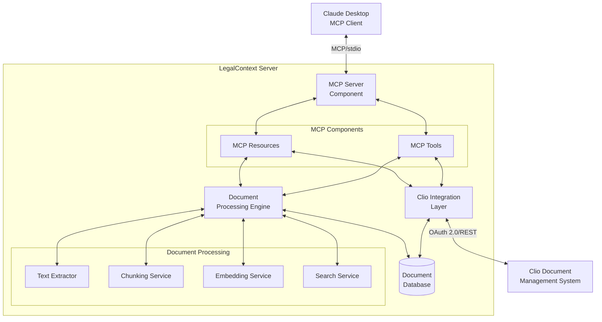
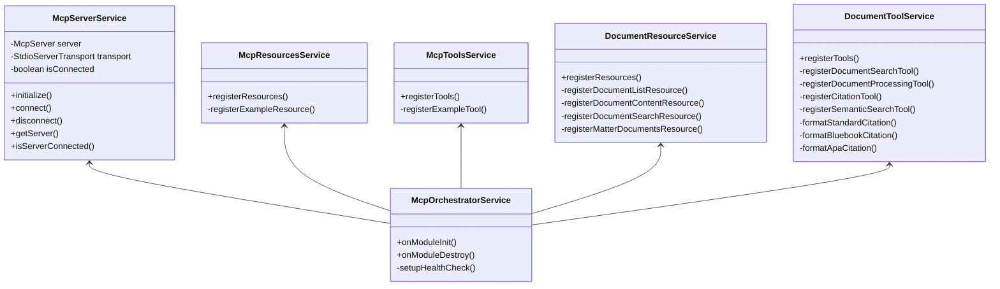
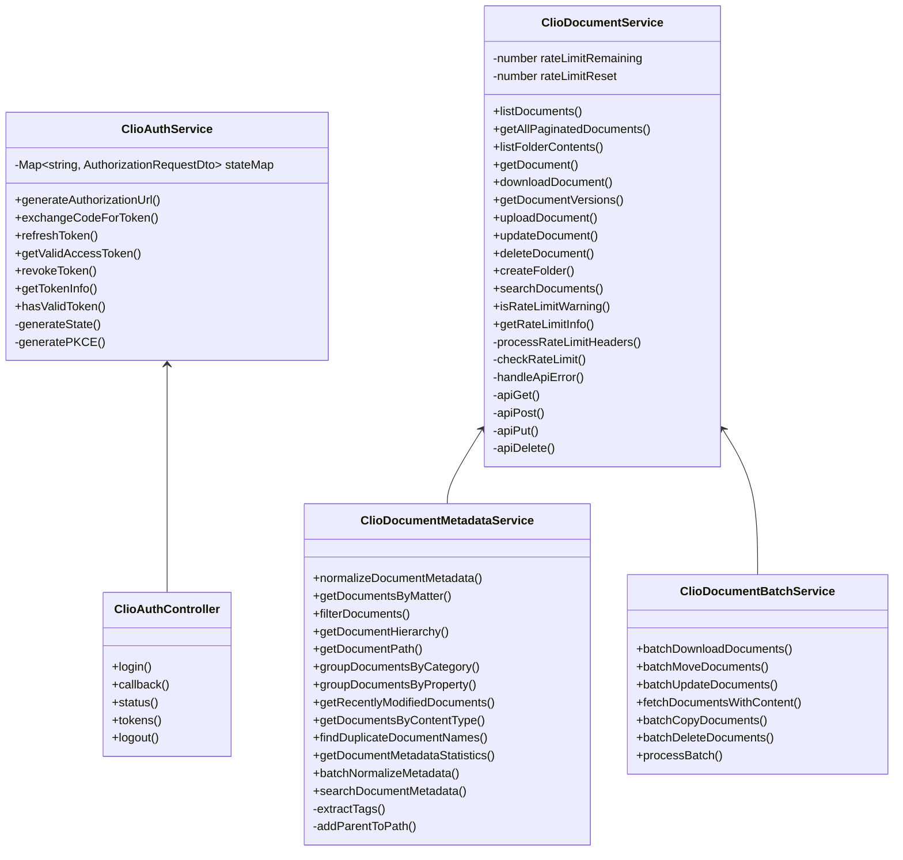
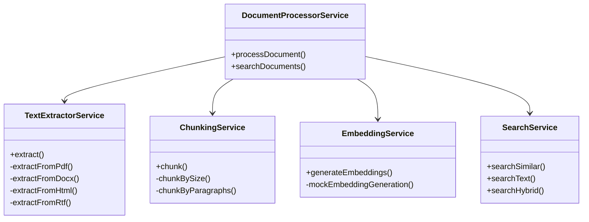
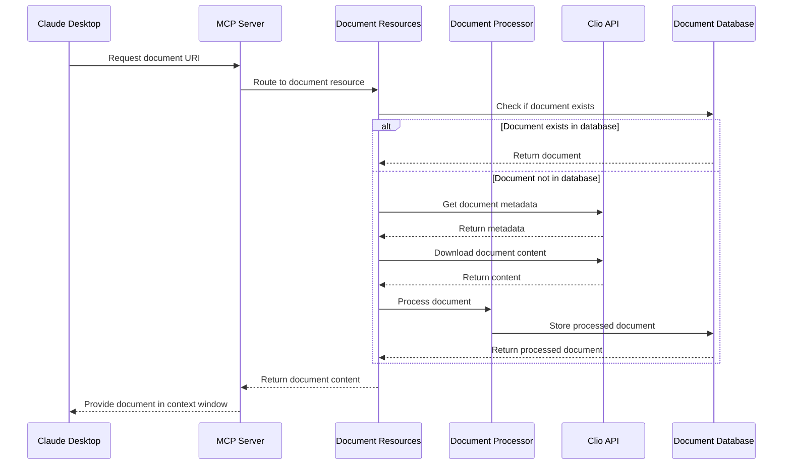
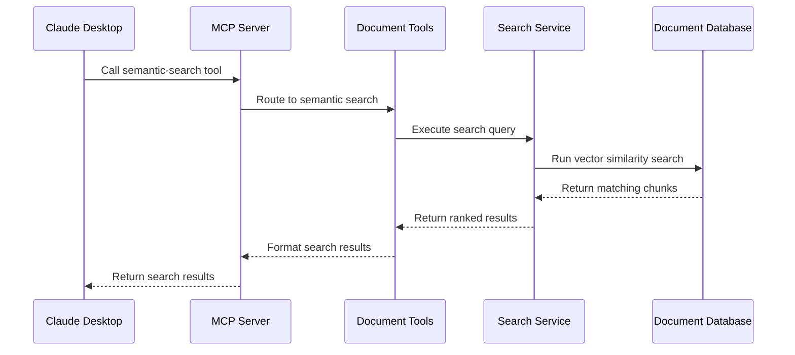
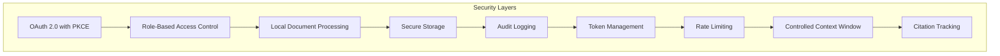
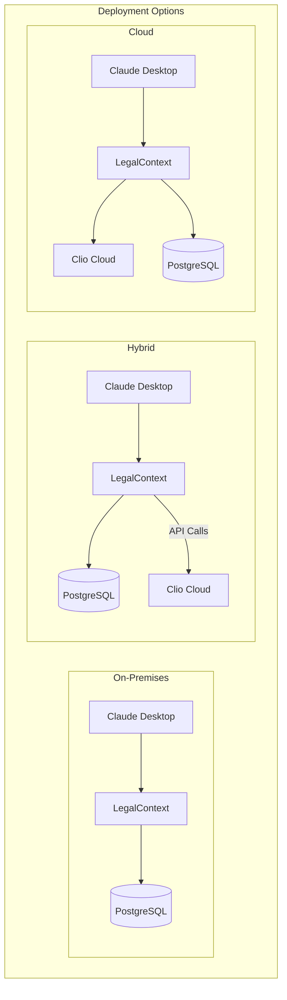
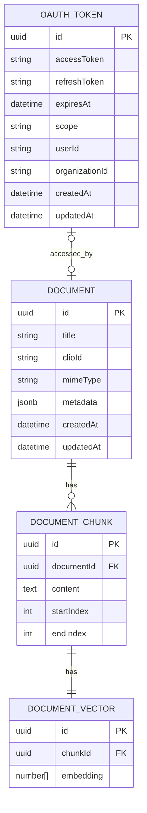
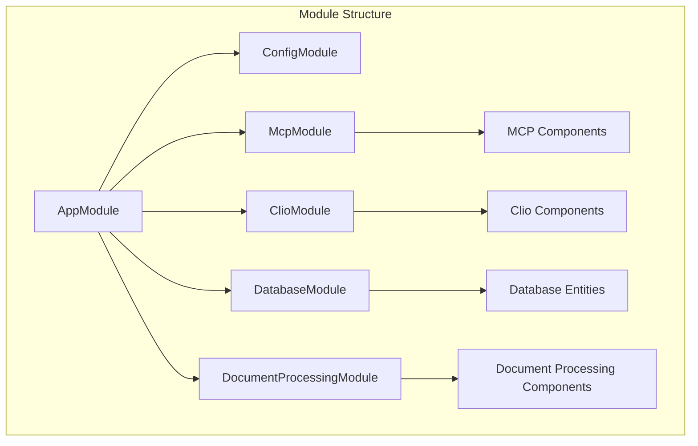

# LegalContext Architecture

## System Architecture Overview

LegalContext is built on a modular architecture that creates a secure bridge between law firms' document management systems (Clio) and AI assistants (Claude Desktop) using the Model Context Protocol (MCP).

## Component Architecture

### MCP Server Component

The MCP Server is the core component that implements the Model Context Protocol to allow Claude Desktop to access firm documents securely. It manages the connection with Claude and routes requests to the appropriate resources and tools.

### Clio Integration Layer

The Clio Integration Layer provides secure, authenticated access to the firm's document management system through Clio's API.

### Document Processing Engine

The Document Processing Engine extracts text from documents, chunks it into manageable segments, generates embeddings for semantic search, and provides search capabilities.

## Data Flow

### Document Access Flow

The following diagram shows the flow of data when Claude requests document content:

### Document Search Flow

The following diagram shows the flow of data when Claude performs a semantic search:

## Security Architecture

LegalContext implements several security layers to ensure document confidentiality and access control:

### Security Components

1. **OAuth 2.0 with PKCE** - All access to Clio's API is authenticated using OAuth 2.0 flow with PKCE for enhanced security.

2. **Role-Based Access Control** - Document access respects the permission model defined in Clio.

3. **Local Document Processing** - All document processing occurs locally within the firm's security perimeter.

4. **Secure Storage** - Document content and metadata are stored securely in the local database.

5. **Audit Logging** - All document access and operations are logged for audit purposes.

6. **Token Management** - Access tokens are securely stored and refreshed when needed.

7. **Rate Limiting** - API calls are rate-limited to prevent abuse and overloading.

8. **Controlled Context Window** - Only specifically requested documents are provided to Claude.

9. **Citation Tracking** - All information provided to Claude includes source citations for verification.

## Deployment Architecture

LegalContext can be deployed in various configurations based on the firm's needs:

## Database Schema

The database schema is designed to efficiently store and retrieve documents and their embeddings:

## Module Organization

The codebase is organized into several NestJS modules:

## Technologies Used

- **Runtime**: Bun (for high performance JavaScript/TypeScript execution)
- **Framework**: NestJS (for modular architecture and dependency injection)
- **Language**: TypeScript (for type safety and developer experience)
- **Database**: PostgreSQL with pgvector extension (for vector similarity search)
- **API Integration**: OAuth 2.0, REST (for Clio API interaction)
- **Protocol**: MCP - Model Context Protocol (for standardized AI interaction)
