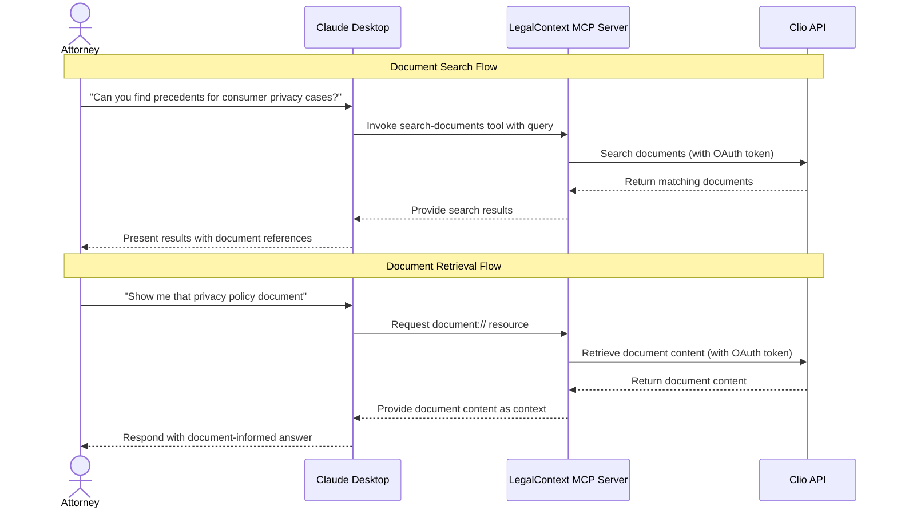

# Integrating Clio Documents with Claude Through MCP

This guide explains how to expose Clio documents to Claude Desktop through the Model Context Protocol (MCP).

## Overview

The integration between Clio, LegalContext, and Claude uses the Model Context Protocol (MCP) to safely expose document content to the AI assistant without compromising security or privacy.



## Implementation Components

### 1. MCP Resources

MCP Resources expose Clio documents as context for Claude:

#### Document List Resource

```typescript
server.resource(
  'document-list',
  new ResourceTemplate('documents://list/{filter}/{page}', { list: undefined }),
  async (uri, params) => {
    // Parse parameters
    const { filter, page } = params;
    
    // Retrieve documents from Clio
    const documents = await clioDocumentService.listDocuments({
      // Convert filter parameters
    });
    
    // Format response for Claude
    return {
      contents: [{
        uri: uri.href,
        text: formatDocumentList(documents)
      }]
    };
  }
);
```

#### Document Content Resource

```typescript
server.resource(
  'document',
  new ResourceTemplate('document://{id}', { list: undefined }),
  async (uri, params) => {
    // Extract document ID
    const { id } = params;
    
    // Retrieve document from Clio
    const document = await clioDocumentService.getDocument(id);
    const content = await clioDocumentService.downloadDocument(id);
    
    // Process content for Claude
    const processedContent = await documentProcessorService.processContent(content, document.content_type);
    
    // Format response
    return {
      contents: [{
        uri: uri.href,
        text: `# ${document.name}\n\n${processedContent}`
      }]
    };
  }
);
```

### 2. MCP Tools

MCP Tools enable Claude to search and interact with documents:

#### Search Documents Tool

```typescript
server.tool(
  'search-documents',
  {
    query: z.string(),
    limit: z.number().optional(),
    matter_id: z.string().optional()
  },
  async ({ query, limit = 5, matter_id }) => {
    // Perform search in Clio documents
    const results = await searchService.searchDocuments(query, {
      limit,
      matter_id
    });
    
    // Format results for Claude
    return {
      content: [{
        type: 'text',
        text: formatSearchResults(results)
      }]
    };
  }
);
```

#### Document Processing Tool

```typescript
server.tool(
  'process-document',
  {
    document_id: z.string()
  },
  async ({ document_id }) => {
    // Process document in background
    await documentProcessorService.processDocument(document_id);
    
    return {
      content: [{
        type: 'text',
        text: `Document processing initiated for document ID: ${document_id}`
      }]
    };
  }
);
```

### 3. Document Processing

To make documents usable by Claude, they need to be processed:

1. **Content Extraction**: Extract text from various document formats (PDF, DOCX, etc.)
2. **Chunking**: Split documents into semantic chunks for context window management
3. **Indexing**: Create searchable index for document retrieval
4. **Citation Marking**: Add citation identifiers for accurate attribution

```typescript
// Extract text based on MIME type
async extract(document: Buffer, mimeType: string): Promise<string> {
  switch (mimeType) {
    case 'application/pdf':
      return this.extractFromPdf(document);
    case 'application/vnd.openxmlformats-officedocument.wordprocessingml.document':
      return this.extractFromDocx(document);
    case 'text/plain':
      return document.toString('utf-8');
    // Other formats...
    default:
      throw new UnsupportedDocumentTypeException(mimeType);
  }
}

// Chunk document text into semantic sections
chunk(text: string, options?: ChunkingOptions): DocumentChunk[] {
  const chunkSize = options?.chunkSize ?? this.defaultChunkSize;
  const chunkOverlap = options?.chunkOverlap ?? this.defaultChunkOverlap;
  
  // Implementation of semantic chunking algorithm
  // ...
}
```

## Security Considerations

### 1. Data Boundary Control

All document processing happens within the LegalContext server, which runs inside the law firm's security perimeter. Document content never leaves this boundary.

### 2. Access Control

- LegalContext respects document permissions from Clio
- Document access is limited to authorized users
- All access attempts are logged for audit purposes

### 3. Context Isolation

- Each MCP session maintains isolated context
- Document content is only available to the specific Claude session that requested it
- Contextual data is not persisted beyond the current session

## Best Practices

### 1. Document Processing

- **Preserve Structure**: Maintain document structure (headings, lists, paragraphs)
- **Handle Metadata**: Include relevant metadata like creation date and author
- **Optimize Chunks**: Create semantically meaningful chunks that preserve context
- **Clean Content**: Remove irrelevant elements like headers/footers and page numbers

### 2. Context Management

- **Prioritize Relevance**: Send the most relevant document portions to Claude
- **Context Window Awareness**: Be mindful of Claude's context window limitations
- **Citation Preservation**: Maintain clear citation information for all content
- **Incremental Loading**: Load additional context as needed based on conversation

### 3. User Experience

- **Clear Attribution**: Always show source documents for information
- **Permission Checks**: Verify access permissions before retrieving documents
- **Error Handling**: Provide clear error messages when documents cannot be accessed
- **Performance Optimization**: Minimize latency in document retrieval and processing

## Integration Examples

### Example 1: Basic Document Search

```typescript
// Claude prompt: "Find documents about privacy policies"

// MCP Tool call
const result = await client.callTool("search-documents", {
  query: "privacy policy",
  limit: 5
});

// Result
{
  content: [{
    type: "text",
    text: "Found 3 documents about privacy policies:\n\n1. Client Privacy Policy Template (ID: doc-123)\n2. Data Protection Procedures (ID: doc-456)\n3. Privacy Notice Review Checklist (ID: doc-789)"
  }]
}
```

### Example 2: Document Retrieval

```typescript
// Claude prompt: "Show me the privacy policy template"

// MCP Resource retrieval
const resource = await client.readResource("document://doc-123");

// Resource content
{
  contents: [{
    uri: "document://doc-123",
    text: "# Client Privacy Policy Template\n\nLast updated: January 2024\n\n## 1. Introduction\n\nThis Privacy Policy describes how we collect, use, and disclose your personal information..."
  }]
}
```

## Conclusion

The integration between Clio, LegalContext, and Claude through MCP creates a secure bridge for document context. By following these implementation patterns, law firms can safely leverage AI assistance while maintaining control over sensitive client information.

1. **MCP Resources** provide document context to Claude
2. **MCP Tools** enable document search and retrieval
3. **Document Processing** extracts and optimizes content
4. **Security Measures** maintain data boundary control

This architecture ensures that document content never leaves the firm's security perimeter while still allowing Claude to provide valuable insights based on the firm's knowledge base.
