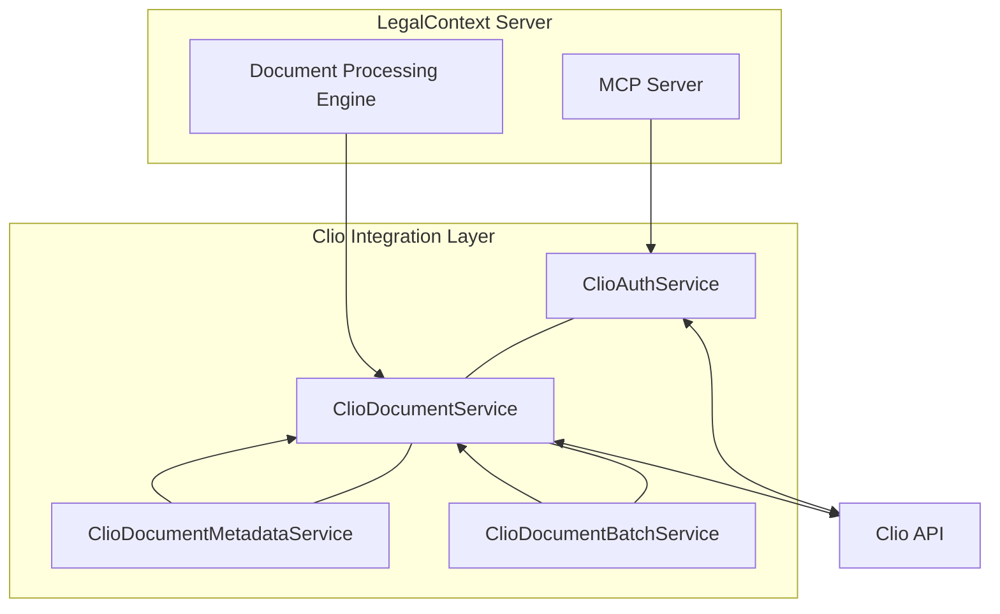
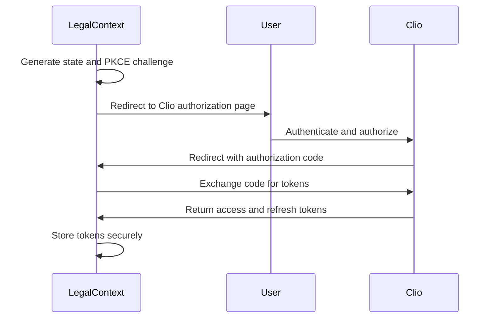

# Clio API Integration

## Overview

This document provides technical details on the integration between LegalContext and Clio's document management system. The integration uses Clio's API V4 to securely access, retrieve, and work with legal documents, including maintaining document metadata and ensuring all security constraints are respected.

## Architecture 

The Clio integration is built upon several core services that manage different aspects of the document workflow:



### Core Services

1. **ClioAuthService** - Handles OAuth 2.0 authentication with PKCE, including token management and refresh.
2. **ClioDocumentService** - Core document API wrapper for performing CRUD operations on documents.
3. **ClioDocumentMetadataService** - Specializes in extracting, normalizing, and working with document metadata.
4. **ClioDocumentBatchService** - Provides efficient batch operations for working with multiple documents.

## Authentication Flow

LegalContext uses OAuth 2.0 with PKCE (Proof Key for Code Exchange) to securely authenticate with Clio's API:



### Token Management

- Access tokens are stored securely in the database
- Refresh tokens are used to obtain new access tokens when they expire
- Tokens can be revoked from the API for security

## Document Operations

### Core Document Operations

- **List Documents** - Retrieve a paginated list of documents with filtering
- **Get Document** - Retrieve metadata for a specific document
- **Download Document** - Download the content of a document
- **Upload Document** - Upload a new document to Clio
- **Update Document** - Update document metadata
- **Delete Document** - Delete a document

### Batch Operations

- **Batch Download** - Download multiple documents efficiently
- **Batch Move** - Move multiple documents to a new folder
- **Batch Copy** - Copy documents to a different folder
- **Batch Update** - Update metadata for multiple documents
- **Batch Delete** - Delete multiple documents

### Metadata Operations

- **Normalize Metadata** - Transform Clio's metadata format to a standard format
- **Document Hierarchy** - Build document folder structure
- **Document Path** - Construct full path for a document
- **Group by Category** - Group documents by their categories
- **Recent Documents** - Get recently modified documents

## Error Handling

The integration includes robust error handling:

1. **Custom Error Types** - Specialized errors for different API failure scenarios
2. **Rate Limiting** - Automatic handling of API rate limits
3. **Retry Logic** - Intelligent retry for transient failures
4. **Error Logging** - Comprehensive logging of errors for troubleshooting

## Security Considerations

The Clio integration is designed with security as a top priority:

1. **OAuth 2.0 with PKCE** - Secure authentication without storing client secrets
2. **Token Encryption** - Tokens are stored securely in the database
3. **Minimal Scope** - Only requesting necessary API permissions
4. **Local Processing** - Document content stays within the firm's security perimeter
5. **Audit Logging** - All document operations are logged for audit purposes

## Integration Limitations

1. **API Rate Limits** - Clio enforces API rate limits that must be respected
2. **Large Document Support** - Documents larger than 25MB may require special handling
3. **Document Types** - Some document formats may have limited metadata extraction capabilities
4. **Custom Fields** - Custom field handling requires specific configuration
5. **Search Limitations** - Clio's API has limited full-text search capabilities

## Pagination Handling

The Clio API returns paginated results for document lists, which the integration handles through:

1. **Automatic Pagination** - `getAllPaginatedDocuments` method to fetch all pages transparently
2. **Page Control** - Manual page control when needed
3. **Efficient Batching** - Processing documents in batches to avoid memory issues with large collections

## Document Versioning

Clio's document versioning is supported through:

1. **Version Listing** - Retrieve all versions of a document
2. **Version Download** - Download specific versions of a document
3. **Version Metadata** - Access metadata for specific document versions

## Implementation Details

### Rate Limit Management

```typescript
// Example of rate limit handling
private async checkRateLimit(): Promise<void> {
  if (this.rateLimitRemaining <= 0) {
    const now = Math.floor(Date.now() / 1000);
    if (this.rateLimitReset > now) {
      const waitTime = this.rateLimitReset - now;
      this.logger.warn(`Rate limit exceeded, reset in ${waitTime} seconds`);
      throw new DocumentApiRateLimitError(`Reset in ${waitTime} seconds`, waitTime);
    }
  }
}
```

### Batch Processing Pattern

```typescript
// Example of batch processing pattern
async processBatch<T, R>(
  items: T[],
  operation: (item: T) => Promise<R>,
  batchSize: number = 10,
  delayMs: number = 2000
): Promise<{ results: R[], errors: Record<number, string> }>
```

## Configuration

The Clio integration requires the following configuration options:

```typescript
// Configuration structure
{
  clio: {
    clientId: string;      // OAuth client ID
    clientSecret: string;  // OAuth client secret
    redirectUri: string;   // OAuth redirect URI
    apiUrl: string;        // Clio API URL
  }
}
```

## Testing

To test the Clio API integration:

1. **Setup Test Environment** - Create a test account or use a sandbox environment
2. **Run `bun run test:clio:auth`** - Test the OAuth flow
3. **Run Unit Tests** - Execute the unit test suite for the Clio module
4. **Run Integration Tests** - Test the full document workflow

## Troubleshooting

Common issues and solutions:

1. **Authentication Failures** - Check credentials and PKCE implementation
2. **Rate Limit Exceeded** - Implement backoff strategy or reduce request frequency
3. **Permission Errors** - Verify OAuth scopes are correctly configured
4. **Document Not Found** - Check document ID and permissions
5. **API Changes** - Check for Clio API updates and adapt as needed

## Future Enhancements

Planned improvements to the Clio integration:

1. **Webhook Support** - Implement webhooks for real-time document updates
2. **Advanced Search** - Enhance search capabilities with AI-powered relevance ranking
3. **Bulk Import/Export** - Improve efficiency for large document sets
4. **Matter Integration** - Deeper integration with matter management features
5. **User Permission Sync** - Synchronize Clio permissions with LegalContext

## Implementation Notes

When working with the Clio API:

1. **API Stability** - The V4 API is generally stable but watch for deprecation notices
2. **Idempotency** - Use idempotent operations when possible for reliability
3. **Error Handling** - Always implement robust error handling for API calls
4. **Token Management** - Be careful with token storage and refresh mechanisms
5. **Rate Limiting** - Respect rate limits to avoid being throttled by the API
