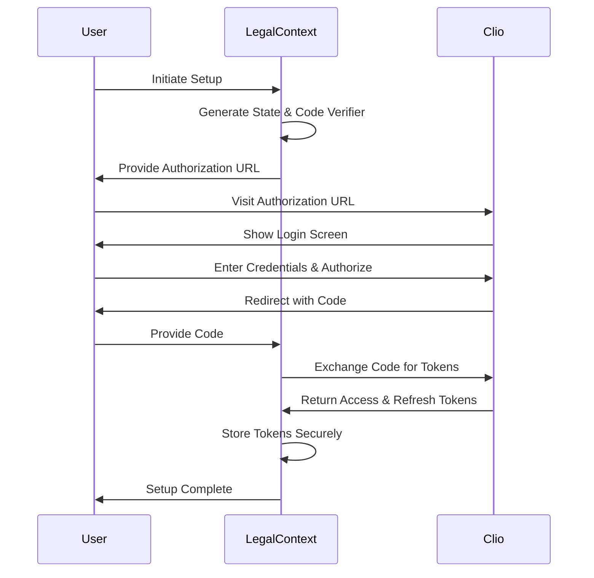

# Clio OAuth 2.0 Integration

This document outlines the OAuth 2.0 integration with Clio's API for LegalContext.

## Overview

LegalContext uses OAuth 2.0 with PKCE (Proof Key for Code Exchange) to securely authenticate with Clio's API. This ensures that:

1. User credentials are never exposed to LegalContext
2. Access is limited to only the permissions (scopes) required
3. Tokens can be revoked without changing passwords
4. The authentication process follows security best practices

## OAuth 2.0 Flow

The implementation follows the standard OAuth 2.0 Authorization Code flow with PKCE:



## Security Measures

1. **State Parameter**: Prevents CSRF attacks by validating that the OAuth response matches the original request.
2. **PKCE**: Prevents authorization code interception attacks by requiring a code verifier.
3. **Secure Token Storage**: Tokens are stored in a database with proper encryption.
4. **Automatic Token Refresh**: Tokens are automatically refreshed before they expire.
5. **Token Revocation**: Tokens can be revoked if compromised.

## Required Permissions

The integration requires the following permissions (scopes) from Clio:

- `documents`: Access to read document metadata and content

## Setup Process

### Prerequisites

1. A Clio account with API access
2. Clio API credentials (Client ID and Client Secret)
3. A registered redirect URI in the Clio Developer Portal

### Configuration

Set the following environment variables:

```
CLIO_CLIENT_ID=your_client_id
CLIO_CLIENT_SECRET=your_client_secret
CLIO_REDIRECT_URI=http://127.0.0.1:3000/clio/auth/callback
CLIO_API_URL=https://app.clio.com/api/v4
```

### Running the Setup

1. Run the setup script:

```bash
bun run setup:clio
```

2. Follow the prompts to authorize with Clio.
3. After authorization, the tokens will be stored and ready to use.

## Testing the Integration

You can verify the integration works by running:

```bash
bun run test:clio
```

## API Reference

### ClioAuthService

The `ClioAuthService` provides the following methods:

- `generateAuthorizationUrl()`: Generates the authorization URL for the OAuth flow
- `exchangeCodeForToken(code, state)`: Exchanges an authorization code for access and refresh tokens
- `getValidAccessToken()`: Gets a valid access token, refreshing if necessary
- `refreshToken(token)`: Refreshes an expired token
- `revokeToken(token)`: Revokes a token

### OAuth Endpoints

The integration exposes the following HTTP endpoints:

- `GET /clio/auth/login`: Initiates the OAuth flow
- `GET /clio/auth/callback`: Handles the OAuth callback
- `GET /clio/auth/status`: Shows the current authentication status

## Error Handling

The integration handles the following error cases:

1. **Invalid State**: If the state parameter doesn't match, the callback is rejected
2. **Authorization Errors**: If the user denies access or Clio returns an error
3. **Token Refresh Failures**: If token refresh fails, the user is prompted to re-authenticate
4. **API Errors**: Network or server errors during API calls

## Implementation Notes

- The integration uses TypeORM for token storage
- Tokens are automatically refreshed 5 minutes before expiration
- PKCE is implemented using SHA-256 hash function
- The state parameter is a cryptographically secure random value
