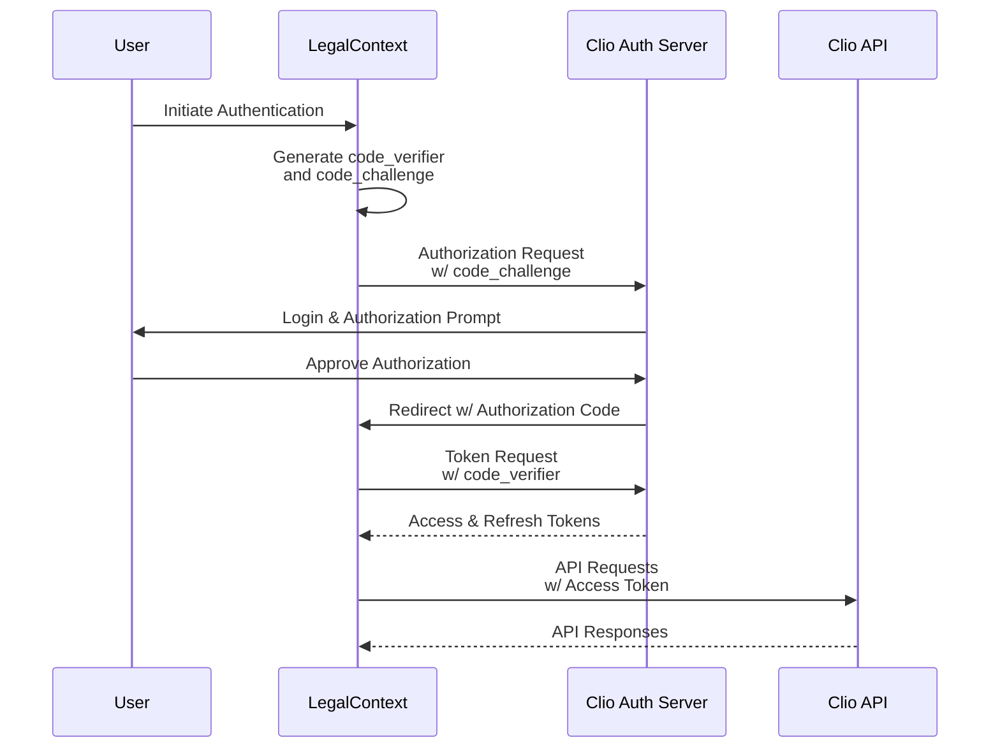

# Clio OAuth 2.0 Authentication Integration

This document outlines the OAuth 2.0 authentication flow implemented in LegalContext for secure communication with the Clio document management system.

## Architecture Overview

The Clio authentication implementation follows the OAuth 2.0 Authorization Code flow with PKCE (Proof Key for Code Exchange) for enhanced security. This approach is especially important for applications where the client secret cannot be securely stored, and provides protection against authorization code interception attacks.



## Components

The authentication system consists of the following components:

1. **ClioAuthService**: Core service that manages OAuth flow and token lifecycle
2. **ClioAuthController**: Provides HTTP endpoints for the authentication flow
3. **OAuthToken**: Database entity for securely storing tokens
4. **TokenResponse/AuthorizationRequestDto**: Data transfer objects for auth flow

## Authentication Flow

### 1. Initialize Authentication

The user triggers authentication by visiting `/clio/auth/login`, which:

1. Generates a random `code_verifier`
2. Creates a `code_challenge` using SHA-256 hashing
3. Redirects to Clio's authorization URL with PKCE parameters

### 2. Authorization

The user authenticates with Clio and approves access permissions. Clio then redirects back to the application's callback URL with an authorization code.

### 3. Token Exchange

When LegalContext receives the callback, it:

1. Validates the returned state parameter
2. Exchanges the authorization code for access and refresh tokens
3. Securely stores the tokens in the database

### 4. API Access

For subsequent API requests, LegalContext:

1. Retrieves the stored access token
2. Checks token expiration
3. Automatically refreshes the token when needed
4. Uses the token for authenticating API requests

## Security Considerations

The implementation includes several security enhancements:

1. **PKCE Flow**: Protects against authorization code interception
2. **State Parameter**: Prevents CSRF attacks
3. **Token Encryption**: Tokens are securely stored in the database
4. **Automatic Token Refresh**: Ensures continuous operation without user intervention
5. **Token Revocation**: Provides the ability to revoke tokens when needed

## Configuration

The Clio OAuth integration requires the following configuration parameters:

| Parameter | Description | Example |
|-----------|-------------|---------|
| `clio.clientId` | OAuth client ID from Clio | `abcdef123456` |
| `clio.clientSecret` | OAuth client secret from Clio | `secret123` |
| `clio.redirectUri` | Callback URL registered with Clio | `http://localhost:3000/clio/auth/callback` |
| `clio.apiUrl` | Clio API base URL | `https://app.clio.com/api/v4` |

These values should be set in the environment variables or `.env` file.

## Obtaining Clio API Credentials

To use the Clio integration, you'll need to:

1. Create a Clio developer account at https://app.clio.com/developers
2. Register a new application to obtain client credentials
3. Configure the redirect URI to match your LegalContext installation
4. Request access to the required scopes (typically 'documents')

## Testing Authentication

LegalContext includes a testing script to verify the authentication flow:

```bash
# Run the authentication test script
bun run test:clio:auth
```

## API Endpoints

| Endpoint | Method | Description |
|----------|--------|-------------|
| `/clio/auth/login` | GET | Initiates the OAuth flow |
| `/clio/auth/callback` | GET | Handles the OAuth callback |
| `/clio/auth/status` | GET | Provides the current authentication status |
| `/clio/auth/tokens` | GET | Lists information about available tokens |
| `/clio/auth/logout` | POST | Revokes the current access token |

## Implementation Details

### State Management

The `ClioAuthService` maintains a `stateMap` to track ongoing authorization requests. Each entry has:

- A unique state value (sent to the authorization server)
- The PKCE code verifier (for code exchange)
- Expiration time (for security)

The service periodically cleans up expired states to prevent memory leaks.

### Token Storage

Tokens are stored in the PostgreSQL database using the `OAuthToken` entity. This approach:

1. Persists tokens across application restarts
2. Allows for token revocation and management
3. Supports concurrent access from multiple LegalContext instances

### Error Handling

The implementation includes comprehensive error handling for:

- Network failures
- Invalid or expired tokens
- Authorization rejections
- Server errors

All errors are properly logged with relevant context for troubleshooting.

## Best Practices

When working with the authentication system:

1. Always use `getValidAccessToken()` instead of accessing tokens directly
2. Handle authentication errors appropriately in API clients
3. Use the test script to verify configuration before integration
4. Monitor token expiration and refresh events in logs

## Troubleshooting

Common issues and solutions:

1. **"Invalid state parameter"**: The authorization request has expired or was tampered with. Try again with a fresh authorization request.

2. **"Failed to refresh token"**: The refresh token may be expired or invalid. The user will need to re-authenticate.

3. **"No OAuth token found"**: No valid tokens in the database. The user must complete the initial authorization flow.

4. **Redirect URI mismatch**: Ensure the redirect URI configured in Clio's developer portal exactly matches the one in your LegalContext configuration, including protocol (http/https), domain, port, and path.

5. **Client ID or Secret mismatch**: Double-check that the client ID and secret in your configuration match what's provided in Clio's developer portal.

6. **Network connectivity issues**: Ensure your LegalContext instance can connect to Clio's authentication and API endpoints. Check for any firewall or proxy settings that might block these connections.

7. **Scope issues**: If you see "insufficient scope" errors, ensure that your Clio application is configured with the correct permissions (typically 'documents').

8. **Expired state errors**: If you see frequent "state expired" errors, check your system clock to ensure it's properly synchronized.

## Extending the Authentication System

The authentication system is designed to be extensible for future needs:

### Supporting Multiple Organizations

To support multiple Clio organizations:

1. Extend the `OAuthToken` entity to include an organization identifier
2. Modify `getValidAccessToken()` to accept an organization parameter
3. Use appropriate tokens based on the organization context

### Enhanced Security

For additional security:

1. Consider implementing token encryption at rest
2. Add IP-based restrictions for token usage
3. Implement more granular permission controls

### Monitoring and Auditing

For production environments:

1. Add detailed audit logging for authentication events
2. Set up monitoring for token lifecycle events
3. Create alerts for authentication failures or unusual patterns

## References

1. [OAuth 2.0 RFC](https://tools.ietf.org/html/rfc6749)
2. [PKCE RFC](https://tools.ietf.org/html/rfc7636)
3. [Clio API Documentation](https://app.clio.com/api/v4/documentation)
4. [NestJS Authentication Documentation](https://docs.nestjs.com/security/authentication)
