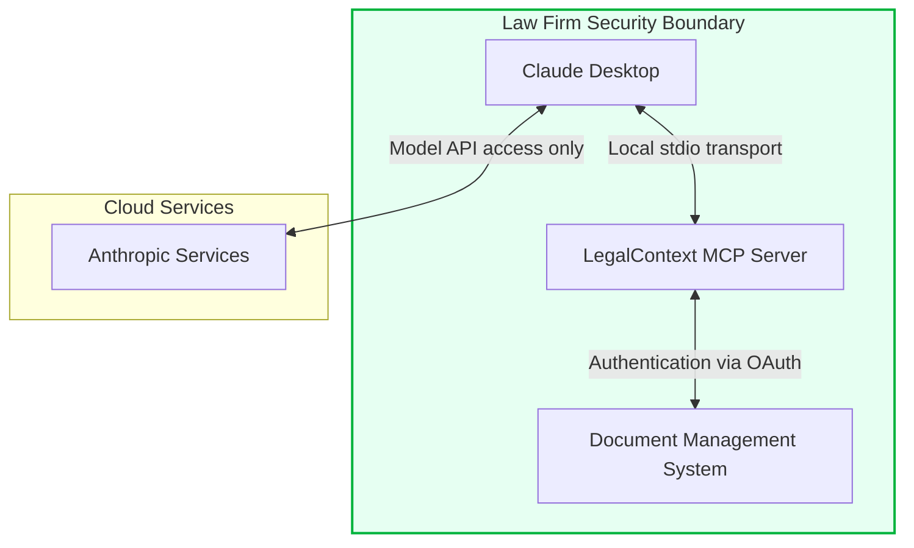

# LegalContext Security Architecture

This document outlines the security architecture of LegalContext, focusing on how it secures sensitive legal documents while enabling AI-assisted legal research.

## Security Design Principles

LegalContext is built on the following security principles:

1. **Data Boundary Control**: All document processing remains within the firm's security perimeter
2. **Least Privilege**: Components operate with minimal necessary permissions
3. **Transport Security**: Secure communication protocols between components
4. **Access Control**: Respect for underlying document management system permissions
5. **Audit Logging**: Comprehensive logging of all access and operations

## Component Security

### MCP Server Security

The MCP (Model Context Protocol) server is the primary interface between Claude and the document management system. Security considerations include:

1. **Local Processing**: The MCP server runs locally within the firm's network
2. **Stdio Transport**: Communication with Claude Desktop uses stdio, ensuring data doesn't traverse network boundaries
3. **Permission Scoping**: Resource and tool access is scoped to specific document repositories
4. **Content Validation**: All input and output is validated to prevent injection attacks

### Document Access Security

Access to documents is secured through multiple layers:

1. **OAuth 2.0 Integration**: Secure authentication with document management systems
2. **Token Management**: Secure storage and handling of access tokens
3. **Permissions Inheritance**: Document access respects the permissions defined in the source system
4. **Content Filtering**: Sensitive content can be filtered based on configured rules

### Data-in-Transit Security

1. **Local Communication**: Primary communication occurs locally via stdio
2. **TLS for API Access**: All communication with document management APIs uses TLS 1.2+
3. **Token Security**: OAuth tokens are securely stored and never exposed

### Data-at-Rest Security

1. **No Document Storage**: Documents are processed in memory and not persisted
2. **Metadata Encryption**: Any cached metadata is encrypted using industrial-strength encryption
3. **Token Encryption**: OAuth tokens are encrypted at rest

## Security Controls

### Authentication & Authorization

1. **Document Management Authentication**: OAuth 2.0 flow for secure access
2. **Access Control**: Enforcement of document-level permissions
3. **Fine-grained Authorization**: Controls on which documents can be accessed

### Audit & Compliance

1. **Access Logging**: All document access is logged with:
   - User identity
   - Document identifier
   - Access timestamp
   - Access type (read, search)

2. **Operation Logging**: All operations are logged for audit purposes
3. **Compliance Reports**: Generate reports for compliance requirements

### Incident Response

1. **Revocation Procedures**: Quick revocation of access if security issues are detected
2. **Monitoring**: Real-time monitoring for suspicious access patterns
3. **Alerting**: Automated alerts for potential security incidents

## Deployment Security Recommendations

For secure deployment of LegalContext:

1. **Network Isolation**: Deploy on an isolated network segment
2. **Minimal Dependencies**: Reduce attack surface by minimizing dependencies
3. **Regular Updates**: Keep all components updated with security patches
4. **Penetration Testing**: Regular security testing of the deployment
5. **Access Controls**: Restrict administrative access to LegalContext

## Data Privacy Considerations

LegalContext is designed to maintain data privacy:

1. **No Data Transmission**: Document content never leaves the firm's security boundary
2. **Minimized Metadata**: Only essential metadata is used
3. **Privacy by Design**: Data privacy considerations are built into the architecture

## Security Certification

LegalContext security architecture aligns with industry standards:

1. **OWASP Compliance**: Follows OWASP secure development practices
2. **ISO 27001 Alignment**: Designed with ISO 27001 information security principles

## Conclusion

The LegalContext security architecture ensures that sensitive legal documents remain secure while enabling AI-assisted legal research. By maintaining a strict security boundary and implementing multiple layers of protection, LegalContext provides a secure bridge between document management systems and AI tools.
