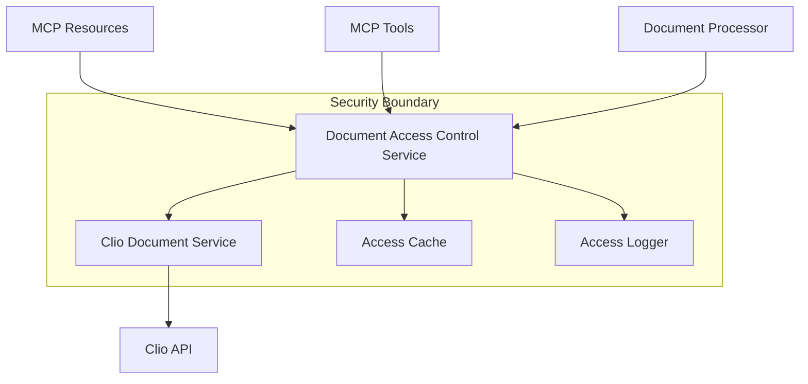

# Document Access Controls

## Overview

LegalContext respects and enforces Clio's document access control permissions to ensure secure access to sensitive legal documents.

The access control system is implemented in the `DocumentAccessControlService` which integrates with the Clio API to validate access permissions before allowing any document operations.

## Access Control Architecture

## Key Features

### 1. Permission Inheritance

The access control system inherits permissions directly from Clio. This means:

- Access is only granted if the user would have access through the Clio interface
- Access control decisions respect document sharing settings in Clio
- Changes to permissions in Clio are reflected in LegalContext

### 2. Access Caching

To improve performance and reduce load on the Clio API:

- Access permissions are cached for a configurable period (default: 5 minutes)
- Cache entries include metadata to avoid unnecessary document retrieval
- The cache is automatically invalidated when necessary

### 3. Batch Processing

For efficiency when dealing with multiple documents:

- Support for batch access checking using parallel processing
- Document filtering based on access permissions
- Pagination-aware access control

### 4. Comprehensive Logging

For audit and security purposes:

- All access attempts (successful and denied) are logged
- Logs include timestamp, user ID, document ID, and access decision
- In production, these logs would be stored persistently for audit purposes

## Implementation Details

### Access Check Process

1. Check the access cache for a stored decision
2. If no cache entry exists, call Clio API to check permissions
3. If Clio API returns the document, access is granted
4. If Clio API returns 403 Forbidden, access is denied
5. Cache the result for future checks
6. Log the access event

### Integration Points

The access control system is integrated with:

1. **MCP Resources** - Enforces access controls for:
   - Document content resource
   - Document list resource
   - Document search resource
   - Matter documents resource

2. **MCP Tools** - Enforces access controls for:
   - Document search tool
   - Document processing tool
   - Citation generation tool
   - Semantic search tool

3. **Document Processing Engine** - Enforces access controls for:
   - Document processing
   - Document search

## Security Considerations

### Data Boundary Control

- All access control decisions happen within the firm's security perimeter
- No sensitive information leaves the system during access checks
- The access control service acts as a security boundary within the application

### Error Handling

- Access denied errors are properly caught and handled
- Security errors are never exposed with sensitive details
- Appropriate error messages maintain security while being informative

### Rate Limiting

- The access control service respects Clio API rate limits
- Batch operations are designed to minimize API calls
- Caching reduces the risk of rate limit issues

## Testing and Verification

To test the access control implementation:

1. Run the test script: `bun run test:clio:access`
2. Choose from various test options:
   - Single document access test
   - Batch document access test
   - Document list filtering test

## Future Enhancements

1. Add support for user-specific access controls
2. Implement role-based access control for local resources
3. Add support for document category-level permissions
4. Develop an audit dashboard for access monitoring
